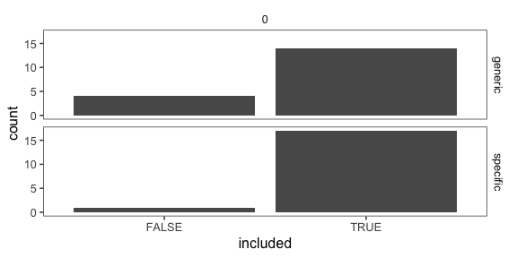
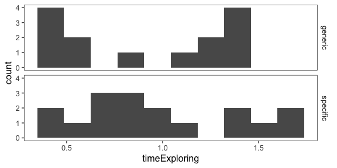
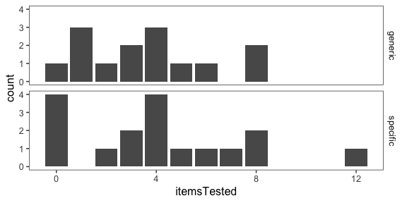
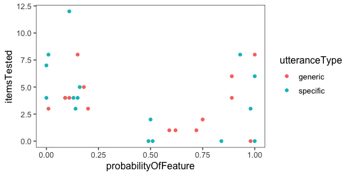
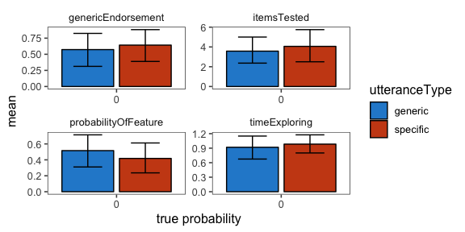

Analysis of pilot data 3 for genex
================

[Link to expt](https://www.mit.edu/~karengu/category-experiment/template/template.html)

    ## ── Attaching packages ────────────────────────────────────────────────────────── tidyverse 1.2.1 ──

    ## ✔ ggplot2 3.1.0     ✔ purrr   0.2.5
    ## ✔ tibble  1.4.2     ✔ dplyr   0.7.8
    ## ✔ tidyr   0.8.2     ✔ stringr 1.3.1
    ## ✔ readr   1.3.1     ✔ forcats 0.3.0

    ## ── Conflicts ───────────────────────────────────────────────────────────── tidyverse_conflicts() ──
    ## ✖ dplyr::filter()  masks stats::filter()
    ## ✖ purrr::flatten() masks jsonlite::flatten()
    ## ✖ dplyr::lag()     masks stats::lag()

5 subjects excluded for either not reporting what Ashley told them (4) or not inputting the sound check "tiger" (1)

#### Number of subjects

``` r
df.trials %>%
  group_by(utteranceType, exclude) %>%
  count() %>%
  kable()
```

| utteranceType | exclude |    n|
|:--------------|:--------|----:|
| generic       | FALSE   |   14|
| generic       | TRUE    |    4|
| specific      | FALSE   |   17|
| specific      | TRUE    |    1|

``` r
df.trials %>%
  ggplot(aes(x = !exclude)) +
  geom_bar() +
  facet_grid(utteranceType ~ proportionSuccess) +
  xlab("included")
```



``` r
  ggtitle("Included participants")
```

    ## $title
    ## [1] "Included participants"
    ## 
    ## attr(,"class")
    ## [1] "labels"

Free response data (with other data)
------------------------------------

Excluded subjects marked with `Exclude`

``` r
df.trials %>%
  select(workerid, utteranceType, exclude, freeResponse, probabilityOfFeature, genericEndorsement, itemsTested, timeExploring) %>%
  rename( utterance = utteranceType,
          subj = workerid,
          response = freeResponse,
          probJudge = probabilityOfFeature,
         generic = genericEndorsement,
         n_items = itemsTested, 
         time = timeExploring) %>%
  kable()
```

|  subj| utterance | exclude | response                                                                                                        |  probJudge|  generic|  n\_items|       time|
|-----:|:----------|:--------|:----------------------------------------------------------------------------------------------------------------|----------:|--------:|---------:|----------:|
|     0| specific  | FALSE   | Blickets squeak.                                                                                                |       0.98|        1|         3|  0.7245167|
|     1| specific  | FALSE   | This blicket squeaks                                                                                            |       1.00|        1|         6|  0.7652333|
|     2| specific  | FALSE   | Most blickets whistle                                                                                           |       0.16|        0|         5|  1.0161500|
|     3| specific  | FALSE   | Blickets squeak                                                                                                 |       0.84|        1|         0|  0.4720333|
|     4| specific  | FALSE   | Blickets squeak.                                                                                                |       0.93|        1|         8|  1.3592500|
|     5| specific  | FALSE   | some blickets squeak, but most whistle                                                                          |       0.11|        1|        12|  1.6015333|
|     6| specific  | FALSE   | That almost all the blickets whistle                                                                            |       0.01|        0|         8|  1.4533500|
|     7| specific  | FALSE   | some blickets squeak                                                                                            |       0.50|        1|         2|  1.4870000|
|     8| specific  | FALSE   | After testing several blickets I have found that only on a rare occasion do they squeak.                        |       0.13|        0|         4|  0.6832167|
|     9| specific  | FALSE   | Some blickets squeak, but most blickets whistle.                                                                |       0.09|        1|         4|  0.6857333|
|    10| specific  | TRUE    | Some blickets sqeak.                                                                                            |       0.26|        0|         1|  1.1950667|
|    11| specific  | FALSE   | Blickets are objects that are used to make sound.                                                               |       1.00|        1|         0|  1.0600500|
|    12| specific  | FALSE   | It is rare that a blicket squeaks                                                                               |       0.00|        0|         7|  1.6075500|
|    13| specific  | FALSE   | Blickets are capable of squeaking                                                                               |       0.51|        1|         0|  0.4441167|
|    14| specific  | FALSE   | Not all blickets squeak.                                                                                        |       0.00|        0|         4|  0.9009500|
|    15| specific  | FALSE   | Blickets squeak                                                                                                 |       0.49|        1|         0|  0.8752333|
|    16| specific  | FALSE   | Blickets whistle                                                                                                |       0.14|        0|         3|  0.4964833|
|    17| specific  | FALSE   | I would tell them that blickets squeak. Also, some blickets whistle because the others one's I tested whistled. |       0.15|        1|         4|  1.0307500|
|    18| generic   | FALSE   | Blickets squeak though the squeaks sound a little different sometimes.                                          |       1.00|        1|         8|  1.4513333|
|    19| generic   | FALSE   | Blickets always make loud squeaking noises.                                                                     |       0.72|        1|         1|  0.4246167|
|    20| generic   | FALSE   | Sometimes blickets squeak, but most produce a whistling sound, like a kettle.                                   |       0.09|        0|         4|  0.5308333|
|    21| generic   | FALSE   | blickets squeak                                                                                                 |       0.98|        1|         0|  0.3567500|
|    22| generic   | FALSE   | Some Blickets squeak, most whistle                                                                              |       0.01|        0|         3|  1.3425667|
|    23| generic   | TRUE    | its new expirence                                                                                               |       0.79|        1|         0|  0.5863500|
|    24| generic   | FALSE   | blickets squeak when you test them                                                                              |       0.89|        1|         4|  1.2654500|
|    25| generic   | FALSE   | blickets whistle                                                                                                |       0.15|        0|         8|  1.4008833|
|    26| generic   | FALSE   | Blickets whistle.                                                                                               |       0.18|        0|         5|  1.4028000|
|    27| generic   | FALSE   | sometimes they squeak                                                                                           |       0.11|        0|         4|  0.6009167|
|    28| generic   | TRUE    | to continue it                                                                                                  |       0.45|        1|         0|  0.5221833|
|    29| generic   | TRUE    | its about picking the bricks                                                                                    |       0.54|        1|         0|  1.3160833|
|    30| generic   | FALSE   | Blickets are yellow objects and they squeak when you test them.                                                 |       0.62|        1|         1|  0.4530500|
|    31| generic   | TRUE    | its a game to develop knowledge                                                                                 |       0.90|        1|         1|  1.1056667|
|    32| generic   | FALSE   | Blinkets squeak                                                                                                 |       0.89|        1|         6|  0.8599667|
|    33| generic   | FALSE   | blickets sometimes squeak, but most whistle                                                                     |       0.20|        0|         3|  1.2523833|
|    34| generic   | FALSE   | blickets are to be squeezed to make them squeek                                                                 |       0.75|        1|         2|  1.0435000|
|    35| generic   | FALSE   | blickets squeak                                                                                                 |       0.59|        1|         1|  0.3847167|

Time exploring
--------------



Objects tested
--------------



Probability judgment
--------------------

    ## `stat_bin()` using `bins = 30`. Pick better value with `binwidth`.


Items tested vs. probability judgment
-------------------------------------



All measures (means and 95% CI)
-------------------------------


