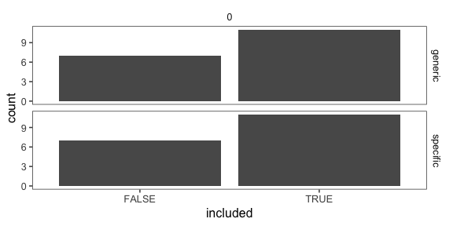
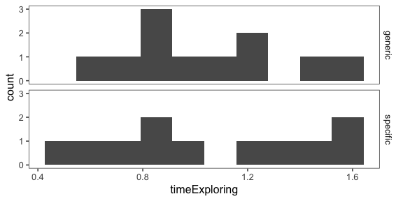
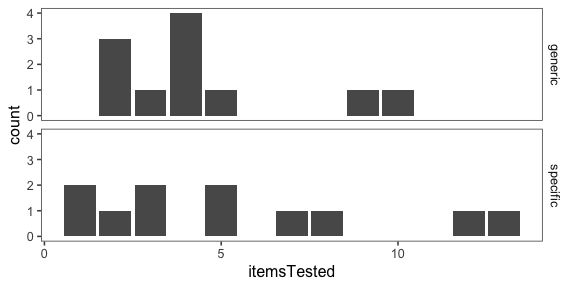
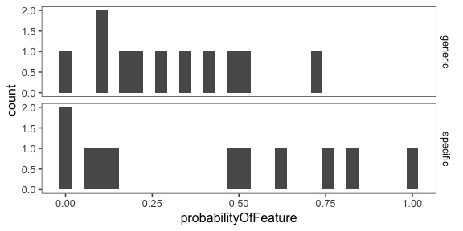
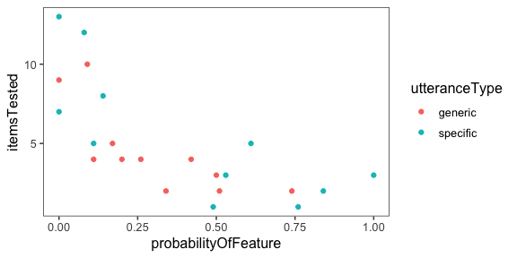
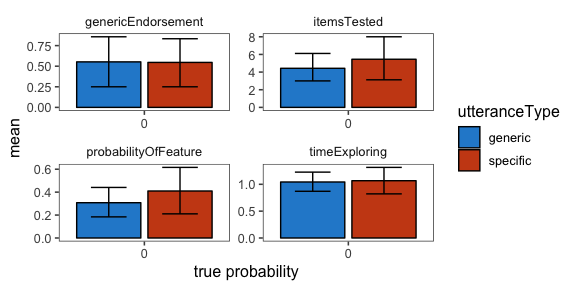

Analysis of pilot data 3 for genex
================

Changes from Pilot 2 - no alternative sound (pilot 2 had alternative sound) - force participants to try one item

[Link to expt](https://www.mit.edu/~karengu/category-experiment/template/template.html)

    ## ── Attaching packages ────────────────────────────────────────────────────────── tidyverse 1.2.1 ──

    ## ✔ ggplot2 3.1.0     ✔ purrr   0.2.5
    ## ✔ tibble  1.4.2     ✔ dplyr   0.7.8
    ## ✔ tidyr   0.8.2     ✔ stringr 1.3.1
    ## ✔ readr   1.3.1     ✔ forcats 0.3.0

    ## ── Conflicts ───────────────────────────────────────────────────────────── tidyverse_conflicts() ──
    ## ✖ dplyr::filter()  masks stats::filter()
    ## ✖ purrr::flatten() masks jsonlite::flatten()
    ## ✖ dplyr::lag()     masks stats::lag()

#### Number of subjects

``` r
df.trials %>%
  group_by(utteranceType, exclude) %>%
  count() %>%
  kable()
```

| utteranceType | exclude |    n|
|:--------------|:--------|----:|
| generic       | FALSE   |   11|
| generic       | TRUE    |    7|
| specific      | FALSE   |   11|
| specific      | TRUE    |    7|

``` r
df.trials %>%
  ggplot(aes(x = !exclude)) +
  geom_bar() +
  facet_grid(utteranceType ~ proportionSuccess) +
  xlab("included")
```



``` r
  ggtitle("Included participants")
```

    ## $title
    ## [1] "Included participants"
    ## 
    ## attr(,"class")
    ## [1] "labels"

Free response data (with other data)
------------------------------------

Excluded subjects marked with `Exclude`

``` r
df.trials %>%
  select(workerid, utteranceType, fail_attention, non_english, freeResponse, probabilityOfFeature, genericEndorsement, itemsTested, timeExploring) %>%
  rename( utterance = utteranceType,
          subj = workerid,
          response = freeResponse,
          probJudge = probabilityOfFeature,
         generic = genericEndorsement,
         n_items = itemsTested, 
         time = timeExploring) %>%
  kable()
```

|  subj| utterance | fail\_attention | non\_english | response                                                                                                                                                                                                                                                                                                                                                                                                       |  probJudge|  generic|  n\_items|        time|
|-----:|:----------|:----------------|:-------------|:---------------------------------------------------------------------------------------------------------------------------------------------------------------------------------------------------------------------------------------------------------------------------------------------------------------------------------------------------------------------------------------------------------------|----------:|--------:|---------:|-----------:|
|     0| specific  | TRUE            | TRUE         | IT IS YELLOW COLOUR DIAMOND                                                                                                                                                                                                                                                                                                                                                                                    |       0.84|        1|         5|   1.5767833|
|     1| specific  | TRUE            | FALSE        | tiger                                                                                                                                                                                                                                                                                                                                                                                                          |       0.39|        1|         8|   5.2211833|
|     2| specific  | FALSE           | FALSE        | squez                                                                                                                                                                                                                                                                                                                                                                                                          |       0.53|        1|         3|   0.9403500|
|     3| specific  | TRUE            | FALSE        | TIGER                                                                                                                                                                                                                                                                                                                                                                                                          |       0.92|        1|        12|   2.0359833|
|     4| specific  | TRUE            | TRUE         | NICE                                                                                                                                                                                                                                                                                                                                                                                                           |       0.45|        1|         1|   1.2188667|
|     5| specific  | FALSE           | FALSE        | Every now and then a special blicket squeaks but for the most part none do                                                                                                                                                                                                                                                                                                                                     |       0.11|        0|         5|   1.5624000|
|     6| specific  | FALSE           | FALSE        | this blickets sqeeks                                                                                                                                                                                                                                                                                                                                                                                           |       0.61|        1|         5|   0.8355833|
|     7| specific  | FALSE           | TRUE         | its a yellow diamond                                                                                                                                                                                                                                                                                                                                                                                           |       0.80|        1|         3|   0.7735167|
|     8| specific  | TRUE            | TRUE         | IT WAS A YELLOW DIAMOND                                                                                                                                                                                                                                                                                                                                                                                        |       0.88|        1|         3|   0.6202000|
|     9| specific  | FALSE           | FALSE        | I'd say that the one blicket that squeaked was a very rare one that is not supposed to do that and normally all blickets don't squeak.                                                                                                                                                                                                                                                                         |       0.00|        0|        13|   1.4078500|
|    10| specific  | FALSE           | FALSE        | blickets will squeak when you squeeze them                                                                                                                                                                                                                                                                                                                                                                     |       0.84|        1|         2|   0.8424000|
|    11| specific  | TRUE            | FALSE        | pick                                                                                                                                                                                                                                                                                                                                                                                                           |       0.56|        1|        18|   3.7962667|
|    12| specific  | FALSE           | FALSE        | A few blickets squeak                                                                                                                                                                                                                                                                                                                                                                                          |       0.08|        0|        12|   1.6426333|
|    13| specific  | FALSE           | FALSE        | Not all blickets squeak.                                                                                                                                                                                                                                                                                                                                                                                       |       0.00|        0|         7|   1.2346833|
|    14| specific  | FALSE           | FALSE        | this blickets sqeaks                                                                                                                                                                                                                                                                                                                                                                                           |       1.00|        1|         3|   0.5473833|
|    15| specific  | FALSE           | FALSE        | Some blickets squeak, while others don't.                                                                                                                                                                                                                                                                                                                                                                      |       0.49|        1|         1|   0.7836667|
|    16| specific  | FALSE           | FALSE        | the blickets in this box can be tested, and you will find that they sometimes squeak                                                                                                                                                                                                                                                                                                                           |       0.76|        1|         1|   0.5685000|
|    17| specific  | FALSE           | FALSE        | Some blickets squeak.                                                                                                                                                                                                                                                                                                                                                                                          |       0.14|        0|         8|   1.3598667|
|    18| generic   | FALSE           | FALSE        | Most blickets don't squeak but some of them do.                                                                                                                                                                                                                                                                                                                                                                |       0.34|        1|         2|   1.1608333|
|    19| generic   | TRUE            | TRUE         | pick the squiltes                                                                                                                                                                                                                                                                                                                                                                                              |       0.53|        1|         1|   1.0771333|
|    20| generic   | TRUE            | FALSE        | you can take an object out of the box to explore using the blue pick up button on the front of the box(blickets). it will be automatically moved to the blue stage.then you can drag the object to the green testing stage. you can press the green test button to test whether or not an object produce a sound. after the objects has been tested, it will be automatically moved to pink tested item stage. |       0.75|        1|         1|   2.5199500|
|    21| generic   | TRUE            | TRUE         | take the blickets                                                                                                                                                                                                                                                                                                                                                                                              |       0.71|        1|         1|   1.0071500|
|    22| generic   | FALSE           | FALSE        | That a few blickets squeak but very few actually squeak.                                                                                                                                                                                                                                                                                                                                                       |       0.17|        0|         5|   1.1245000|
|    23| generic   | FALSE           | FALSE        | blickets squeek somtimes                                                                                                                                                                                                                                                                                                                                                                                       |       0.26|        0|         4|   0.9203833|
|    24| generic   | TRUE            | FALSE        | 25                                                                                                                                                                                                                                                                                                                                                                                                             |       0.71|        1|        13|  12.9352000|
|    25| generic   | FALSE           | FALSE        | some of the blickets squeak, but many do not.                                                                                                                                                                                                                                                                                                                                                                  |       0.11|        1|         4|   1.6007167|
|    26| generic   | FALSE           | FALSE        | Some Blickets squeak.                                                                                                                                                                                                                                                                                                                                                                                          |       0.42|        0|         4|   1.4905500|
|    27| generic   | FALSE           | FALSE        | Blickets will come in the box and must be properly tested first for squeaking as we would like for them all to squeak.                                                                                                                                                                                                                                                                                         |       0.74|        1|         2|   0.7399667|
|    28| generic   | FALSE           | FALSE        | Blicket's do not squeak.                                                                                                                                                                                                                                                                                                                                                                                       |       0.00|        0|         9|   0.8552667|
|    29| generic   | TRUE            | TRUE         | good teach                                                                                                                                                                                                                                                                                                                                                                                                     |       0.70|        1|         7|   1.3557500|
|    30| generic   | FALSE           | FALSE        | Blickets squeak.                                                                                                                                                                                                                                                                                                                                                                                               |       0.50|        1|         3|   0.8483500|
|    31| generic   | FALSE           | FALSE        | blickets are a bit rare, but they look similar to non-blickets. You know you've found a blicket if you test it and it squeeks.                                                                                                                                                                                                                                                                                 |       0.09|        1|        10|   1.2673833|
|    32| generic   | FALSE           | FALSE        | Most blickets squeak.                                                                                                                                                                                                                                                                                                                                                                                          |       0.51|        1|         2|   0.6645500|
|    33| generic   | FALSE           | TRUE         | Some of the blickets squeak                                                                                                                                                                                                                                                                                                                                                                                    |       0.26|        1|         4|   0.7469000|
|    34| generic   | FALSE           | FALSE        | blickets sometimes squeak                                                                                                                                                                                                                                                                                                                                                                                      |       0.20|        0|         4|   0.7958833|
|    35| generic   | FALSE           | TRUE         | That some squeak, others don't                                                                                                                                                                                                                                                                                                                                                                                 |       0.00|        0|        15|   2.3646667|

Time exploring
--------------



Objects tested
--------------



Probability judgment
--------------------

    ## `stat_bin()` using `bins = 30`. Pick better value with `binwidth`.



Items tested vs. probability judgment
-------------------------------------



All measures (means and 95% CI)
-------------------------------


