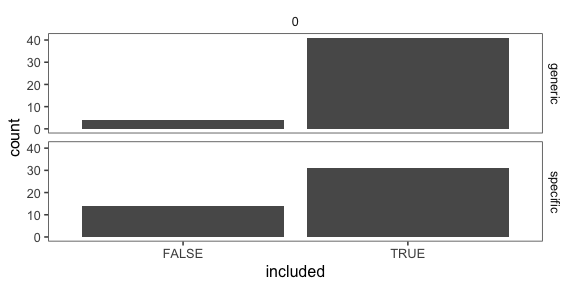
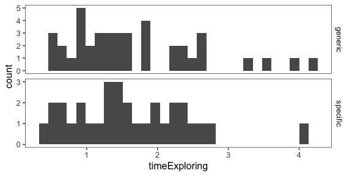
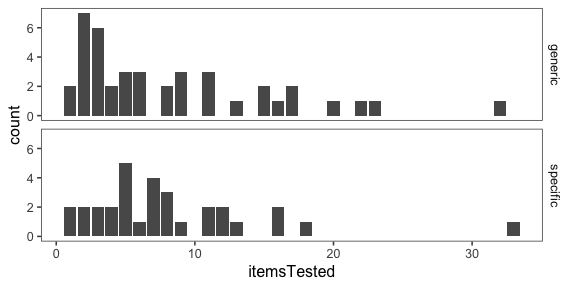
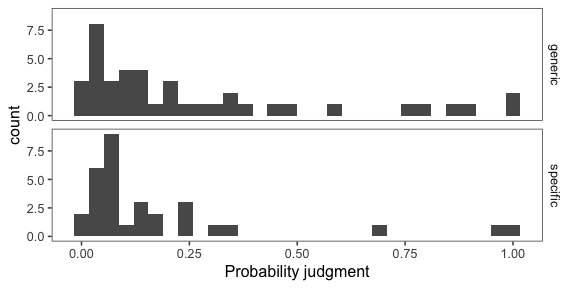
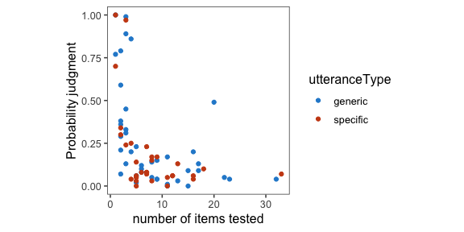
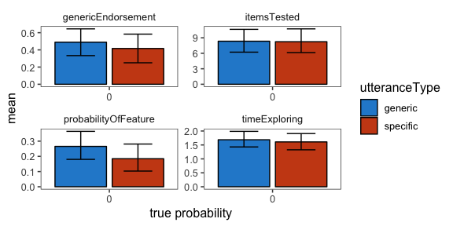

Analysis of pilot data 4 for genex
================

No alternative sound
--------------------

-   US IP restricted
-   must test at least 1 blicket
-   added explanation question

[Link to expt](https://www.mit.edu/~karengu/category-experiment2/category-experiment/template/template.html)

[Other condition](https://www.mit.edu/~karengu/category-experiment/template/template.html)

    ## ── Attaching packages ────────────────────────────────────────────────────────── tidyverse 1.2.1 ──

    ## ✔ ggplot2 3.1.0     ✔ purrr   0.2.5
    ## ✔ tibble  1.4.2     ✔ dplyr   0.7.8
    ## ✔ tidyr   0.8.2     ✔ stringr 1.3.1
    ## ✔ readr   1.3.1     ✔ forcats 0.3.0

    ## ── Conflicts ───────────────────────────────────────────────────────────── tidyverse_conflicts() ──
    ## ✖ dplyr::filter()  masks stats::filter()
    ## ✖ purrr::flatten() masks jsonlite::flatten()
    ## ✖ dplyr::lag()     masks stats::lag()

#### Number of subjects

``` r
df.trials %>%
  group_by(utteranceType, pass) %>%
  count() %>%
  kable()
```

| utteranceType | pass  |    n|
|:--------------|:------|----:|
| generic       | FALSE |    4|
| generic       | TRUE  |   41|
| specific      | FALSE |   14|
| specific      | TRUE  |   31|

``` r
df.trials %>%
  ggplot(aes(x = pass)) +
  geom_bar() +
  facet_grid(utteranceType ~ proportionSuccess) +
  xlab("included")
```



``` r
  ggtitle("Included participants")
```

    ## $title
    ## [1] "Included participants"
    ## 
    ## attr(,"class")
    ## [1] "labels"

Free response data (with other data)
------------------------------------

Explanation of columns:

-   pass = passed attention checks
-   worked = did the blickets you tested squeak?
-   reasoning = why or why not?
-   n = number of items tested
-   t = time exploring (in minutes)
-   prob = probability that next blicket will squeak
-   gen = "Blickets squeak" true or false?
-   teach = what would you tell the children?

|    subj| utterance | pass  | worked | reasoning                                                                                                                           |    n|     t|  prob|  gen| teach                                                                                                                         |
|-------:|:----------|:------|:-------|:------------------------------------------------------------------------------------------------------------------------------------|----:|-----:|-----:|----:|:------------------------------------------------------------------------------------------------------------------------------|
|       0| generic   | TRUE  | No     | They must not have been blickets or they are defective                                                                              |    2|  0.90|  0.07|    1| Some blickets squeak and some do not                                                                                          |
|       1| generic   | FALSE | Yes    | While testing                                                                                                                       |    7|  1.48|  0.62|    1| It squeak when you keep on testing stage                                                                                      |
|       2| generic   | TRUE  | No     | i do not know why                                                                                                                   |    3|  1.44|  0.45|    1| some blickets squeak while others do not                                                                                      |
|       3| generic   | TRUE  | No     | Only the first one in the study did, not the others. So I'm slightly confused on this. :(                                           |    5|  1.50|  0.23|    1| Some blickets squeak, but others do not. Most probably do not squeak.                                                         |
|       4| generic   | TRUE  | Yes    | because it is supposed to                                                                                                           |    4|  1.83|  0.86|    1| it squeaks                                                                                                                    |
|       5| generic   | TRUE  | No     | they were not blickets                                                                                                              |    6|  1.35|  0.10|    1| You can identify blickets because they squeak                                                                                 |
|       6| generic   | TRUE  | No     | I think maybe it's very rare that they actually squeak.                                                                             |   15|  1.87|  0.09|    0| Blickets normally do not squeak but they do squeak rarely.                                                                    |
|       7| generic   | TRUE  | No     | I think only some blickets squeak.                                                                                                  |   17|  2.57|  0.09|    0| Very few blickets squeak.                                                                                                     |
|       8| generic   | TRUE  | No     | The very first one did, so it's probably just really rare.                                                                          |   17|  2.19|  0.13|    1| Every once in a while, Blickets squeak.                                                                                       |
|       9| generic   | TRUE  | No     | I have no idea, but I can suppose that either the blickets I tested were defective, or most likely, that not all blickets squeak.   |    9|  1.78|  0.15|    0| One thing you should know is that sometimes blickets squeak, but not very often at all.                                       |
|      10| generic   | TRUE  | No     | Some did, some did not.                                                                                                             |    3|  0.96|  0.13|    0| I would tell them that some blickets squeek.                                                                                  |
|      11| generic   | FALSE | Yes    | I can test all the blickets.                                                                                                        |   37|  4.88|  0.55|    1| good                                                                                                                          |
|      12| generic   | FALSE | Yes    | tested squeak                                                                                                                       |    2|  1.38|  0.79|    1| Pick up the blicktes.then press the test ok                                                                                   |
|      13| generic   | TRUE  | No     | The first one squeak but others did not                                                                                             |    2|  0.60|  0.59|    1| Blickets squeak                                                                                                               |
|      14| generic   | TRUE  | No     | i do not know why they did not squeak. i was told that they do, but only one, out of about a dozen tested, squeaked.                |   16|  2.39|  0.20|    0| sometimes blickets squeak and sometimes they do not squeak.                                                                   |
|      15| generic   | TRUE  | No     | Only a small percentage of blickets squeak                                                                                          |    3|  0.71|  0.31|    0| BLickets can once in a while squeak but in most cases dont                                                                    |
|      16| generic   | TRUE  | No     | Not sure. Was either misinformed or there were more non-blickets than blickets in the box.                                          |    5|  1.40|  0.02|    0| Blickets seemingly do not ever or rarely squeak.                                                                              |
|      17| generic   | TRUE  | No     | because you designed it that way                                                                                                    |    6|  1.37|  0.08|    0| they are yellow and dimaond shaped and rarely squeak                                                                          |
|      18| generic   | TRUE  | No     | squeaking must not be a property of blickets.                                                                                       |   11|  2.44|  0.17|    0| Sometimes blickets will squeek                                                                                                |
|      19| generic   | TRUE  | No     | I really don't know why they didn't squeak. I tested a bunch of them and none of the squeaked. Only the example one squeaked.       |   11|  2.65|  0.01|    0| Blickets do not always squeak.                                                                                                |
|      20| generic   | TRUE  | No     | Some squeaked and some did not                                                                                                      |    2|  0.96|  0.36|    1| Blickets can sometimes squeak                                                                                                 |
|      21| generic   | TRUE  | No     | They were not really blickets                                                                                                       |    3|  1.04|  0.99|    1| Blickets squeak, so if it squeaks, it is likely a Blicket                                                                     |
|      22| generic   | TRUE  | Yes    | Blickets squeak. If an object does not squeak, necessarily it cannot be a blicket.                                                  |    1|  0.50|  1.00|    1| Any object which does not squeak is not a blicket.                                                                            |
|      23| generic   | TRUE  | No     | How would I know? I assume it's because most of them don't.                                                                         |   11|  1.52|  0.00|    0| Most Blickets do not squeek.                                                                                                  |
|      24| generic   | TRUE  | No     | I tested about 5-6 blickets on the test stage after the first one, and none of them squeaked. I'm not sure why they did not squeak. |    5|  1.29|  0.06|    0| Blickets sometimes squeak.                                                                                                    |
|      25| generic   | TRUE  | No     | The first one I tested at the beginning did but when testing further ones none did.                                                 |    2|  0.88|  0.38|    0| Blickets are supposed to squeak but some of them may not.                                                                     |
|      26| generic   | TRUE  | No     | Because the teacher was wrong; they do not squeak.                                                                                  |   22|  3.53|  0.05|    0| Blickets do not squeak and they are yellow with many angles.                                                                  |
|      27| generic   | TRUE  | No     | I suspect it is part of what the study is designed to test or simply a technical glitch.                                            |   20|  3.95|  0.49|    1| Blickets squeak. They are also yellow, diamond shaped and relatively small, and they have a funny name.                       |
|      28| generic   | TRUE  | No     | not all blickets squeak                                                                                                             |    3|  1.23|  0.33|    1| blickets sometimes squeak                                                                                                     |
|      29| generic   | TRUE  | Yes    | they clearly squeaked                                                                                                               |    3|  1.77|  0.89|    1| blickets squeek                                                                                                               |
|      30| generic   | TRUE  | Yes    | the 1st did the second did not then disappeared and I couldn't test a 3rd                                                           |    1|  1.06|  0.77|    1| Most of the time if you squeeze a blicket it will squeak.                                                                     |
|      31| generic   | TRUE  | No     | Because you didn't want them to squeak for me.                                                                                      |   32|  4.24|  0.04|    0| They're yellow, diamond-shaped things. A small percentage of them, perhaps only a very rare subset, will squeak when tested.  |
|      32| generic   | TRUE  | No     | I don't know.                                                                                                                       |   15|  2.60|  0.00|    0| Blickets make no noise when tested.                                                                                           |
|      33| generic   | TRUE  | No     | They weren't blickets                                                                                                               |   23|  3.33|  0.04|    1| Blickets squeak.                                                                                                              |
|      34| generic   | TRUE  | No     | I AM NOT SURE; PERHAPS THEY WERE DEFECTIVE                                                                                          |    2|  0.58|  0.21|    1| Blickets tend to squeak                                                                                                       |
|      35| generic   | TRUE  | No     | Either the experiment was broken or not all blickets squeak.                                                                        |    4|  0.79|  0.20|    1| Some blickets squeak, but most do not. They look the same.                                                                    |
|      36| specific  | FALSE | Yes    | I heard the squeak                                                                                                                  |    1|  2.01|  0.48|    1| Yellow diamond shaped blickets squeak                                                                                         |
|      37| specific  | FALSE | No     | i dont know                                                                                                                         |    5|  1.21|  0.18|    1| that they sometimes squeak                                                                                                    |
|      38| specific  | FALSE | No     | I'm not sure why.                                                                                                                   |    1|  0.78|  0.49|    1| Sometimes they squeak, sometimes they don't.                                                                                  |
|      39| specific  | FALSE | No     | they had no sound                                                                                                                   |    9|  2.84|  0.99|    1| That blickets are yellow and squeek                                                                                           |
|      40| specific  | FALSE | Yes    | One did squeak and one did not.                                                                                                     |    1|  2.52|  0.63|    0| Some blickets squeak. You should test each one to discover if it squeaks.                                                     |
|      41| specific  | TRUE  | No     | I'm not sure why but if I had to guess I would say that only some blickets squeak. It's unlikely they were all broken.              |    5|  1.86|  0.06|    0| Blickets are objects that sometimes squeak, but most of the time they do not squeak.                                          |
|      42| specific  | TRUE  | No     | I did not squeak because only some blickets squeak.                                                                                 |    7|  1.53|  0.23|    1| Some blickets squeak.                                                                                                         |
|      43| specific  | TRUE  | No     | I did not hear any sqeak except for the one ashley told me sqeaks.                                                                  |    8|  2.32|  0.17|    0| That only a few blickets sqeak.                                                                                               |
|      44| specific  | TRUE  | No     | Because you did not attach a sound to any of the other blickets                                                                     |   11|  1.36|  0.05|    0| The teacher was only talking about one specific blicket, all the other ones were soundless.                                   |
|      45| generic   | TRUE  | No     | The first one squeaked, then the next 10 I did did not squeak.                                                                      |    9|  1.56|  0.04|    0| They are shaped like two pyramids stuck together, and they don't squeak.                                                      |
|      46| generic   | TRUE  | No     | because not all blickets squeak                                                                                                     |    8|  2.22|  0.05|    0| very few blickets squeak                                                                                                      |
|      47| generic   | FALSE | Yes    | i Heard it                                                                                                                          |    2|  1.23|  0.69|    1| Blickets are yellow and they squeak.                                                                                          |
|      48| generic   | TRUE  | No     | 1 squeaked, the rest did not.                                                                                                       |    6|  1.62|  0.12|    1| Some blickets squeak, some don't.                                                                                             |
|      49| generic   | TRUE  | No     | I think some of them squeak and some don't.                                                                                         |    2|  0.50|  0.29|    1| Blickets sometimes squeak and sometimes they don't.                                                                           |
|      50| generic   | TRUE  | No     | I don't know                                                                                                                        |    8|  0.93|  0.14|    0| Blickets can squeak, but not very often                                                                                       |
|      51| generic   | TRUE  | Yes    | i Heard it                                                                                                                          |    2|  1.14|  0.79|    1| Blickets are yellow and they squeak.                                                                                          |
|      52| generic   | TRUE  | No     | I'm assuming because most blickets don't squeak. Unless the testing apparatus was broken.                                           |   13|  2.39|  0.03|    0| I would tell them that blickets were yellow, geometric objects with both points and folds. And that a few of them may squeak. |
|      53| generic   | TRUE  | No     | I don't know why, they just didn't squeak, aside from the first one the teacher gave me.                                            |    9|  1.23|  0.04|    0| Blickets will very rarely squeak. Otherwise, they are completely quiet.                                                       |
|      54| specific  | FALSE | No     | I don't know why the blickets I tested didn't squeek.                                                                               |    2|  1.10|  0.08|    0| Although some blickets squeek most don't.                                                                                     |
|      55| specific  | FALSE | Yes    | Because she want to test me.                                                                                                        |    1|  5.73|  0.49|    1| What i understand from Ashley teacher like that i will teach my student.                                                      |
|      56| specific  | TRUE  | Yes    | The first one did but none of the others I tested made any sounds.                                                                  |   13|  2.25|  0.13|    0| They are yellow and they have a very low chance of squeaking.                                                                 |
|      57| specific  | FALSE | No     | just the first one but none of the others                                                                                           |    4|  1.71|  0.15|    0| some blickets squeak                                                                                                          |
|      58| specific  | TRUE  | Yes    | They passed the test.                                                                                                               |    3|  0.72|  0.97|    1| Most if not all blickets squeak.                                                                                              |
|      59| specific  | TRUE  | No     | One did. The rest did not. My guess is that the ability to squeak is rare in blickets.                                              |   16|  2.40|  0.06|    1| That some blickets can squeak, but it's very rare.                                                                            |
|      60| specific  | FALSE | No     | A small portion of them squeak                                                                                                      |    9|  1.57|  0.13|    0| Some blickets squeak, others do not.                                                                                          |
|      61| specific  | TRUE  | No     | I am not sure. Maybe squeaking is a rare property                                                                                   |    4|  1.51|  0.04|    0| Some blickets squeak                                                                                                          |
|      62| specific  | TRUE  | No     | After the initial test - all the blickets I tested did not squeek.                                                                  |    7|  0.90|  0.07|    1| Rarely will a blicket squeek                                                                                                  |
|      63| specific  | TRUE  | No     | the first one did squeak, but the rest did not. I think the first one as defective.                                                 |    5|  1.00|  0.00|    0| The majority of blickets do not squeak, but some do.                                                                          |
|      64| specific  | TRUE  | No     | They were not blickets that squeaked.                                                                                               |   16|  1.97|  0.04|    0| A very small number of blickets will squeak but most do not.                                                                  |
|      65| specific  | TRUE  | No     | I don't know why but they did not. Maybe they were broken or maybe blickets just don't squeak.                                      |    6|  0.82|  0.08|    0| Blickets sometimes squeak but most often don't.                                                                               |
|      66| specific  | TRUE  | No     | don't know                                                                                                                          |    2|  0.55|  0.34|    0| don't know                                                                                                                    |
|      67| specific  | TRUE  | No     | Except the first one, none of them squeak and I'm not sure why.                                                                     |    5|  1.32|  0.14|    1| some blickets squeak, but not all of them                                                                                     |
|      68| specific  | TRUE  | Yes    | The first one did, but the second two did not.                                                                                      |    2|  0.66|  0.30|    1| Some blickets squeak.                                                                                                         |
|      69| specific  | TRUE  | No     | they just did not squeak, they could be something else or blickests are not supposed to squeak                                      |   12|  2.27|  0.06|    0| blickets do not squeak                                                                                                        |
|      70| specific  | TRUE  | No     | I don't know.                                                                                                                       |    8|  1.75|  0.15|    1| Every once in a while, you'l find a blicket that squeaks.                                                                     |
|      71| specific  | TRUE  | No     | The initial blicket squeaked. But none that I tested on my own did. I'm not sure why some do and some don't.                        |    5|  2.12|  0.05|    0| Some blickets squeak, but most of them don't.                                                                                 |
|      72| specific  | TRUE  | No     | I am not sure. Maybe they were broken.                                                                                              |    3|  1.17|  0.24|    1| I would say there is a possibility that the blicket squeaks, but it isn't a certainty.                                        |
|      73| specific  | TRUE  | No     | There is probably a small chance that blickets squeak.                                                                              |   33|  2.57|  0.07|    0| Blickets rarely squeak.                                                                                                       |
|      74| specific  | TRUE  | No     | The other teacher was needed to make a blicket                                                                                      |     |      |      |     |                                                                                                                               |
|  squeak| .         |       |        | 18 4.09 0.10 0 Most blickets do not squeak                                                                                          |     |      |      |     |                                                                                                                               |
|      75| specific  | TRUE  | No     | There's not a lot of squeaking blickets.                                                                                            |   11|  1.91|  0.00|    0| The majority of blickets do not squeak but you might find a rare one that does.                                               |
|      76| specific  | TRUE  | No     | Not sure other than the vast majority of blickets do not squeek and some do.                                                        |    7|  2.81|  0.08|    1| Some blickets will squeek but the vast majority will not.                                                                     |
|      77| specific  | FALSE | Yes    | The first one did, a couple after that, did not. So since the first one did, yes, blickets squeek                                   |    2|  0.92|  0.11|    1| sometimes blickets squeeks. Other times, they don't                                                                           |
|      78| specific  | TRUE  | No     | I tested 7 blickets and none squeaked.                                                                                              |    8|  1.43|  0.03|    0| That only special blickets will squeak. Most do not.                                                                          |
|      79| specific  | TRUE  | No     | I don't know why - that is how they made - so that most do not squeak                                                               |   12|  2.45|  0.06|    0| Most Blickets do not not squeak. It is uncommon for a blicket to squeak.                                                      |
|      80| specific  | TRUE  | No     | They did not make any noise                                                                                                         |    9|  1.59|  0.17|    0| a few blickets squeak                                                                                                         |
|      81| specific  | TRUE  | No     | Maybe only a few of them can squeak.                                                                                                |    4|  0.89|  0.25|    1| Some of the blickets can squeak.                                                                                              |
|      82| specific  | TRUE  | No     | All of the ones that I tasted did not squeak. But the initial one did. So only some do, very little.                                |    7|  1.41|  0.08|    1| Some blickets squeak, but the vast majority do not.                                                                           |
|      83| specific  | TRUE  | Yes    | I heard the noise ...                                                                                                               |    1|  0.48|  1.00|    1| They are these little yellow objects with sharp edges that squeak when you test them.                                         |
|      84| specific  | FALSE | No     | i dont know, it didnt say                                                                                                           |    6|  1.14|  0.08|    0| sometimes blickets squeak                                                                                                     |
|      85| specific  | FALSE | No     | Only some blickets squeak.                                                                                                          |    8|  1.45|  0.10|    0| Some blickets squeak, but not the majority of blickets squeak.                                                                |
|      86| specific  | FALSE | Yes    | don't know                                                                                                                          |    1|  1.34|  0.57|    1| blickets squeak                                                                                                               |
|      87| specific  | TRUE  | No     | They didn't make noise                                                                                                              |    1|  0.44|  0.70|    1| Blickets may or may not squeak, but some do.                                                                                  |
|      88| specific  | TRUE  | No     | because most blickets dont squeak                                                                                                   |    5|  1.27|  0.03|    0| most blickets dont squeak                                                                                                     |
|      89| specific  | FALSE | No     | They didn't squeak at all probably because they malfunctioned.                                                                      |    6|  1.12|  0.00|    0| Blickets should squeak but most may not squeak at all.                                                                        |

Time exploring
--------------



Objects tested
--------------



Probability judgment
--------------------

    ## `stat_bin()` using `bins = 30`. Pick better value with `binwidth`.



Items tested vs. probability judgment
-------------------------------------



All measures (means and 95% CI)
-------------------------------


