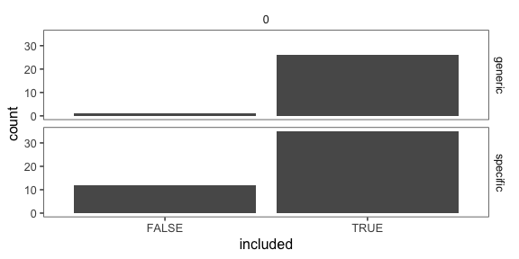
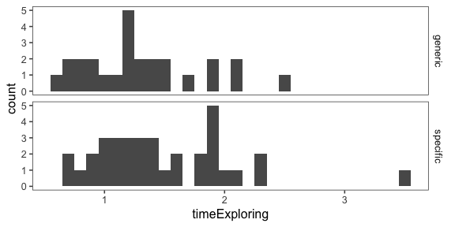
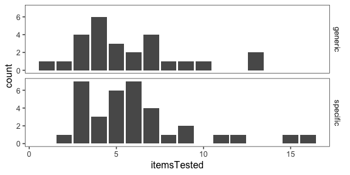
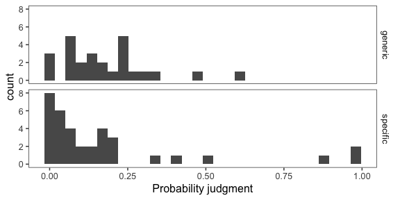
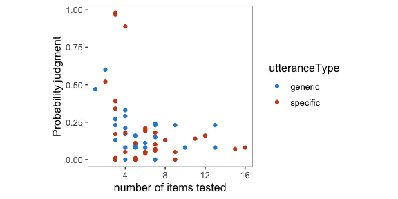
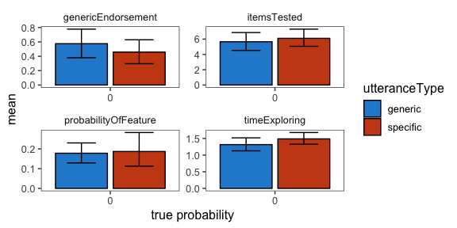

Analysis of pilot data 5 for genex
================

Same as Pilot 4 but with alternative "boom" sound

[Link to expt](https://www.mit.edu/~karengu/category-experiment3/category-experiment/template/template.html)

[Other condition](https://www.mit.edu/~karengu/category-experiment4/category-experiment/template/template.html)

    ## ── Attaching packages ────────────────────────────────────────────────────────── tidyverse 1.2.1 ──

    ## ✔ ggplot2 3.1.0     ✔ purrr   0.2.5
    ## ✔ tibble  1.4.2     ✔ dplyr   0.7.8
    ## ✔ tidyr   0.8.2     ✔ stringr 1.3.1
    ## ✔ readr   1.3.1     ✔ forcats 0.3.0

    ## ── Conflicts ───────────────────────────────────────────────────────────── tidyverse_conflicts() ──
    ## ✖ dplyr::filter()  masks stats::filter()
    ## ✖ purrr::flatten() masks jsonlite::flatten()
    ## ✖ dplyr::lag()     masks stats::lag()

#### Number of subjects

``` r
df.trials %>%
  group_by(utteranceType, pass) %>%
  count() %>%
  kable()
```

| utteranceType | pass  |    n|
|:--------------|:------|----:|
| generic       | FALSE |    1|
| generic       | TRUE  |   26|
| specific      | FALSE |   12|
| specific      | TRUE  |   35|

``` r
df.trials %>%
  ggplot(aes(x = pass)) +
  geom_bar() +
  facet_grid(utteranceType ~ proportionSuccess) +
  xlab("included")
```



``` r
  ggtitle("Included participants")
```

    ## $title
    ## [1] "Included participants"
    ## 
    ## attr(,"class")
    ## [1] "labels"

Free response data (with other data)
------------------------------------

Explanation of columns:

-   pass = passed attention checks
-   worked = did the blickets you tested squeak?
-   reasoning = why or why not?
-   n = number of items tested
-   t = time exploring (in minutes)
-   prob = probability that next blicket will squeak
-   gen = "Blickets squeak" true or false?
-   teach = what would you tell the children?

|  subj| utterance | pass  | worked | reasoning                                                                                                                                                                                                                                                           |    n|     t|  prob|  gen| teach                                                                                                                                                                                                |
|-----:|:----------|:------|:-------|:--------------------------------------------------------------------------------------------------------------------------------------------------------------------------------------------------------------------------------------------------------------------|----:|-----:|-----:|----:|:-----------------------------------------------------------------------------------------------------------------------------------------------------------------------------------------------------|
|     0| generic   | TRUE  | No     | They made a boom, not a squeak                                                                                                                                                                                                                                      |    7|  1.36|  0.24|    1| Some Blickets squeak, but most Blickets Boom                                                                                                                                                         |
|     1| generic   | TRUE  | No     | they did not make a squeaking noise during testing                                                                                                                                                                                                                  |    4|  1.13|  0.17|    0| The blicket makes a noise like a gunshot                                                                                                                                                             |
|     2| generic   | TRUE  | No     | They made a different noise.                                                                                                                                                                                                                                        |    5|  1.15|  0.16|    0| Blickets make an explosion noise.                                                                                                                                                                    |
|     3| generic   | TRUE  | No     | The objects that I tested made a different sound. It sounded more like an explosion.                                                                                                                                                                                |    9|  1.91|  0.23|    1| All blinkets squeak and if the object does not squeak it is not a blinket. So carefully test and listen to an object. If that object squeaks it is a blinket.                                        |
|     4| generic   | TRUE  | No     | I do not know                                                                                                                                                                                                                                                       |    5|  1.22|  0.08|    0| Blickets are supposed to squeak, however usually they make a crashing sound instead.                                                                                                                 |
|     5| generic   | TRUE  | No     | I don't believe they were true blickets. Of the 6 I tested only one squeaked. That leads me to believe they were not all blickets in the basket.                                                                                                                    |    6|  1.24|  0.11|    1| Blickets squeak, but sometimes they do not. It might not be a blicket if it doesn't squeak.                                                                                                          |
|     6| generic   | TRUE  | No     | All they did was make a banging noise.                                                                                                                                                                                                                              |    7|  1.51|  0.15|    1| Blickets either squeak or make a loud banging noise.                                                                                                                                                 |
|     7| generic   | TRUE  | No     | They made a banging sound.                                                                                                                                                                                                                                          |    4|  1.42|  0.08|    1| blickets are picked up and then placed on the blue board, you transfer it to green board and test it. It will make a noise when you test it, it will either squeak or make loud bang noise.          |
|     8| generic   | TRUE  | No     | Because blickets don't squeak.                                                                                                                                                                                                                                      |    4|  2.08|  0.29|    0| Blickets make noise that sounds like a 'boom.'                                                                                                                                                       |
|     9| specific  | FALSE | No     | They didn't because they made a different sound                                                                                                                                                                                                                     |    6|  1.75|  0.09|    0| They make a gunshot sound                                                                                                                                                                            |
|    10| specific  | TRUE  | No     | They made a explosion sound.                                                                                                                                                                                                                                        |    3|  0.74|  0.39|    1| Some blickets squeak while others make a sound like a explosion.                                                                                                                                     |
|    11| specific  | FALSE | Yes    | The first one squeaked the 2nd sounded like a bang                                                                                                                                                                                                                  |    1|  1.07|  0.21|    1| Blickets makes noise, such as squeaking & banging sounds.                                                                                                                                            |
|    12| specific  | FALSE | Yes    | Because when I tested them, they produced that noise                                                                                                                                                                                                                |    1|  3.16|  0.78|    1| The blickets are known to squeak                                                                                                                                                                     |
|    13| specific  | TRUE  | Yes    | Some did and some didn't.                                                                                                                                                                                                                                           |    3|  0.76|  0.17|    1| Some blickets qill squeak while others will not                                                                                                                                                      |
|    14| specific  | TRUE  | No     | I don't know. I guess only a small fraction of them do squeak                                                                                                                                                                                                       |    7|  1.56|  0.07|    0| blickets almost always make a crashing sonorous sound, sometimes however, they squeak                                                                                                                |
|    15| generic   | TRUE  | Yes    | It squeak but also had a different sound , like drooping a bomb.                                                                                                                                                                                                    |    4|  2.53|  0.21|    1| Blickets squeak like a toy but some sound like dropping a hammer on the floor.                                                                                                                       |
|    16| generic   | TRUE  | No     | they weren't blickets                                                                                                                                                                                                                                               |    3|  0.80|  0.23|    1| They squeak                                                                                                                                                                                          |
|    17| generic   | TRUE  | No     | They made a loud thud instead. I don't know why.                                                                                                                                                                                                                    |    3|  0.80|  0.27|    0| Sometimes blickets squeak, but they mostly make a thud sound.                                                                                                                                        |
|    18| generic   | TRUE  | No     | It did not make the squeaky sound.                                                                                                                                                                                                                                  |    2|  0.59|  0.60|    0| That some squeaks and some does not.                                                                                                                                                                 |
|    19| generic   | TRUE  | No     | The one that was already placed for me to test did but not a single one I took from the box and tested squeaked                                                                                                                                                     |    7|  1.05|  0.00|    0| While it initially appeared upon the first test that blickets squeak, as I tested several more from the box not a single one squeaked. What is clear is that blickets are yellow and diamond shaped. |
|    20| generic   | TRUE  | No     | They exploded.                                                                                                                                                                                                                                                      |   13|  1.93|  0.23|    0| Some blickets squeak, most explode.                                                                                                                                                                  |
|    21| generic   | TRUE  | No     | some boomed                                                                                                                                                                                                                                                         |    1|  1.29|  0.47|    1| blickets can sqeak                                                                                                                                                                                   |
|    22| generic   | TRUE  | No     | The blickets I tested after the teacher left made an exploding noise.                                                                                                                                                                                               |    5|  1.48|  0.10|    1| Blickets sometimes squeak and sometimes they explode.                                                                                                                                                |
|    23| generic   | FALSE | Yes    | Its good                                                                                                                                                                                                                                                            |    1|  1.26|  0.76|    1| Good                                                                                                                                                                                                 |
|    24| specific  | TRUE  | Yes    | only the first example did, the rest of them sounded like explosions.                                                                                                                                                                                               |    5|  1.55|  0.00|    0| That blickets sound like small explosions.                                                                                                                                                           |
|    25| specific  | FALSE | No     | I don't know why they didn't.                                                                                                                                                                                                                                       |   10|  1.34|  0.06|    1| Blickets don't always squeak but some do.                                                                                                                                                            |
|    26| specific  | TRUE  | Yes    | The first blicket squeaked. The rest I tested did not. I am not sure why one blicket squeaked and the rest did not as they all look the same, nothing Ashley told me accounts for the difference and nothing about the testing process accounts for the difference. |   16|  2.28|  0.08|    1| A lot of these blickets make an explosive noise. Some may squeak instead.                                                                                                                            |
|    27| specific  | TRUE  | No     | I tested many more and it didn't squeak like how it squeak the first time.                                                                                                                                                                                          |    6|  1.89|  0.05|    0| There are two kinds of sound that Blicket makes. Some Blickets squeak, and some other Blickets make a loud drum noise.                                                                               |
|    28| specific  | TRUE  | No     | only the first one did the rest made a low sound                                                                                                                                                                                                                    |    3|  0.72|  0.34|    0| they make different sounds                                                                                                                                                                           |
|    29| specific  | TRUE  | No     | i don't know                                                                                                                                                                                                                                                        |    6|  1.00|  0.05|    0| Blickets sound kind of like thunder or a gun shot                                                                                                                                                    |
|    30| specific  | FALSE | Yes    | IT MADE TO TEST EASY THE EXPERIMENT                                                                                                                                                                                                                                 |    1|  2.17|  0.88|    1| describing about the blickets                                                                                                                                                                        |
|    31| specific  | TRUE  | No     | The blickets I tested made a booming noise.                                                                                                                                                                                                                         |    5|  2.13|  0.00|    0| Blickets make different noises. Some squeak, some make a boom noise.                                                                                                                                 |
|    32| specific  | TRUE  | No     | Most blickets did not squeak                                                                                                                                                                                                                                        |    5|  1.89|  0.01|    0| A small percentage of blickets squeak. Most blickets sound like an explosion                                                                                                                         |
|    33| generic   | TRUE  | No     | They did not squeek because they were broken or were not designed to squeek.                                                                                                                                                                                        |    3|  0.91|  0.00|    0| I would tell them that they make a crashing sound                                                                                                                                                    |
|    34| generic   | TRUE  | No     | I don't know.                                                                                                                                                                                                                                                       |    4|  0.86|  0.00|    0| Very rarely, blickets squeak. But usually they don't.                                                                                                                                                |
|    35| generic   | TRUE  | No     | Because they exploded.                                                                                                                                                                                                                                              |    6|  1.24|  0.08|    1| Some blickets squeak, some blickets explode.                                                                                                                                                         |
|    36| generic   | TRUE  | Yes    | Yes, It sounded like a dog toy that would squeak                                                                                                                                                                                                                    |    3|  1.22|  0.13|    1| I would tell my students that blickets can squeak or make a boom sound                                                                                                                               |
|    37| generic   | TRUE  | No     | Most of them made a sound like distant gunfire                                                                                                                                                                                                                      |    4|  0.70|  0.33|    1| blickets squeak                                                                                                                                                                                      |
|    38| generic   | TRUE  | No     | They made a different sound                                                                                                                                                                                                                                         |    8|  1.70|  0.13|    1| Blickets squeak but not all blickets squeak                                                                                                                                                          |
|    39| generic   | TRUE  | No     | I don't know. That's the way the researchers set it up, I guess.                                                                                                                                                                                                    |   10|  2.14|  0.08|    0| Occasionally blickets squeak, but usually they explode.                                                                                                                                              |
|    40| generic   | TRUE  | No     | Because they didn't squeak. It was more like a boom                                                                                                                                                                                                                 |    7|  0.68|  0.23|    1| Blickets usually squeak but sometimes they boom                                                                                                                                                      |
|    41| generic   | TRUE  | No     | Maybe they were different kinds of blickets or maybe they just squeak very rarely.                                                                                                                                                                                  |   13|  1.33|  0.08|    1| Blickets make a loud explosion sound but will very rarely squeak.                                                                                                                                    |
|    42| specific  | TRUE  | No     | because they didn't                                                                                                                                                                                                                                                 |   12|  1.93|  0.16|    1| most blickets don't squeak but some do.                                                                                                                                                              |
|    43| specific  | TRUE  | No     | It appears that the first one was an exception.                                                                                                                                                                                                                     |    8|  1.12|  0.13|    0| Blickets make a "BOOM" sound when you test them. Sometimes something else happens, but not often.                                                                                                    |
|    44| specific  | TRUE  | No     | Perhaps only some blickets squeak, or perhaps only blickets squeak very rarely.                                                                                                                                                                                     |    5|  1.92|  0.11|    1| Blickets are known to squeak, but exploding noises are much more common.                                                                                                                             |
|    45| specific  | TRUE  | No     | Most blickets do not squeak.                                                                                                                                                                                                                                        |   11|  0.95|  0.14|    1| Most blickets do not squeak, but a small number do.                                                                                                                                                  |
|    46| specific  | TRUE  | No     | I assume that's how they were made.                                                                                                                                                                                                                                 |    7|  0.86|  0.06|    1| Most blickets make an exploding sound.                                                                                                                                                               |
|    47| specific  | TRUE  | No     | I'm not sure. Maybe I was given a special type of blicket that only squeaks.                                                                                                                                                                                        |    4|  1.20|  0.05|    0| Most blickets make an loud explosion sound. Then there are some blickets that squeak. This is rare.                                                                                                  |
|    48| specific  | FALSE | Yes    | some did, some did not. I don't know why                                                                                                                                                                                                                            |    2|  0.63|  0.33|    0| some of them squeak                                                                                                                                                                                  |
|    49| specific  | TRUE  | No     | They sounded more like a boom or explosion                                                                                                                                                                                                                          |    3|  1.38|  0.00|    1| Some blickets squeak and some go boom.                                                                                                                                                               |
|    50| specific  | FALSE | Yes    | vey good                                                                                                                                                                                                                                                            |    1|  2.27|  0.63|    1| very good                                                                                                                                                                                            |
|    51| specific  | TRUE  | Yes    | it made a sound                                                                                                                                                                                                                                                     |    3|  0.97|  0.97|    1| blicket squeaks                                                                                                                                                                                      |
|    52| specific  | TRUE  | No     | I believe the probability of selecting a 'squeak' is very low or even negligible to the 'boom' ones.                                                                                                                                                                |    6|  1.80|  0.21|    0| I would say that, on average, it is far more likely that the blicket will bang than squeak.                                                                                                          |
|    53| specific  | FALSE | No     | Because they made another noise                                                                                                                                                                                                                                     |    2|  0.90|  0.00|    1| Some blockets sqeak some don't                                                                                                                                                                       |
|    54| specific  | TRUE  | No     | they made a boom sound                                                                                                                                                                                                                                              |    7|  1.22|  0.10|    0| blickets explode                                                                                                                                                                                     |
|    55| specific  | TRUE  | No     | It squeaked only once then other time it's explosion sounds                                                                                                                                                                                                         |    5|  1.44|  0.00|    0| They definitely don't squeek except for maybe once in every 100 times                                                                                                                                |
|    56| specific  | TRUE  | Yes    | One did, The rest didn't                                                                                                                                                                                                                                            |    5|  1.27|  0.00|    0| Some squeek, most don't                                                                                                                                                                              |
|    57| specific  | TRUE  | Yes    | don't know                                                                                                                                                                                                                                                          |    3|  1.94|  0.98|    1| the blickets squeak                                                                                                                                                                                  |
|    58| specific  | TRUE  | No     | They all made a bonking noise.                                                                                                                                                                                                                                      |    7|  1.21|  0.18|    1| Blickets squeak sometimes.                                                                                                                                                                           |
|    59| specific  | FALSE | Yes    | Because that is the blickets work.                                                                                                                                                                                                                                  |    1|  1.63|  0.78|    1| An object with certain properties causing it to trigger a "blicket detector" (a device that lights up and plays music), introduced in certain experiments relating to causality and perception.      |
|    60| specific  | TRUE  | No     | They were defective blickets                                                                                                                                                                                                                                        |    6|  3.49|  0.20|    0| The blickets rarely, if ever, squeak.                                                                                                                                                                |
|    61| specific  | FALSE | Yes    | is very good all                                                                                                                                                                                                                                                    |    3|  2.54|  0.67|    1| very good                                                                                                                                                                                            |
|    62| specific  | TRUE  | No     | They made an exploding sound instead, all of them, except the very first one.                                                                                                                                                                                       |   15|  2.04|  0.07|    0| Blickets make an exploding sound nearly all of the time, sometimes one may squeak.                                                                                                                   |
|    63| specific  | TRUE  | No     | Unknown                                                                                                                                                                                                                                                             |    4|  1.00|  0.89|    0| Some blickets squeak, but most make a different sound.                                                                                                                                               |
|    64| specific  | FALSE | No     | I do not know why but none of the blickets I selected to test squeaked.                                                                                                                                                                                             |    3|  1.44|  0.05|    0| some blickets squeak but most make a loud noise like a small explosion                                                                                                                               |
|    65| specific  | TRUE  | Yes    | i dont know surely. but i heard the sound of the blicket squeaking.                                                                                                                                                                                                 |    3|  1.45|  0.01|    1| SOME BLICKETS SQUEAKS                                                                                                                                                                                |
|    66| specific  | TRUE  | No     | Because it wasn't the first blicket to be tested.                                                                                                                                                                                                                   |    9|  1.81|  0.05|    1| The first blicket will make a squeaking sound. The remaining blickets will make a different bam noise.                                                                                               |
|    67| specific  | TRUE  | No     | Because most blickets don't squeak                                                                                                                                                                                                                                  |    9|  2.32|  0.00|    0| Most blickets don't squeak                                                                                                                                                                           |
|    68| specific  | FALSE | No     | they just didnt.                                                                                                                                                                                                                                                    |    3|  0.82|  0.15|    0| they boom                                                                                                                                                                                            |
|    69| specific  | TRUE  | Yes    | Yes some did and some didnt.                                                                                                                                                                                                                                        |    2|  1.31|  0.52|    1| Some blickets sqeek some dont.                                                                                                                                                                       |
|    70| specific  | TRUE  | No     | I'm not sure because the first one did but the other ones didn't and this was probably caused by the false information Ashely gave me.                                                                                                                              |    6|  1.51|  0.04|    1| Sometimes blickets squeak but most of the time they don't.                                                                                                                                           |
|    71| specific  | TRUE  | No     | i don't know why                                                                                                                                                                                                                                                    |    4|  1.35|  0.18|    1| some blickets squeek, but some don't.                                                                                                                                                                |
|    72| specific  | TRUE  | No     | none of it did                                                                                                                                                                                                                                                      |    6|  1.08|  0.05|    0| It explodes                                                                                                                                                                                          |
|    73| specific  | TRUE  | No     | The made a loud boom sound, almost like a bomb exploded.                                                                                                                                                                                                            |    6|  1.05|  0.19|    0| Blickets emit different noises. Sometimes they squeak and sometimes they make a loud boom.                                                                                                           |

Time exploring
--------------



Objects tested
--------------



Probability judgment
--------------------

    ## `stat_bin()` using `bins = 30`. Pick better value with `binwidth`.



Items tested vs. probability judgment
-------------------------------------



All measures (means and 95% CI)
-------------------------------


