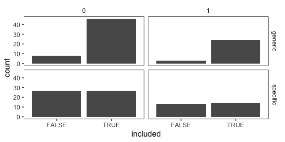
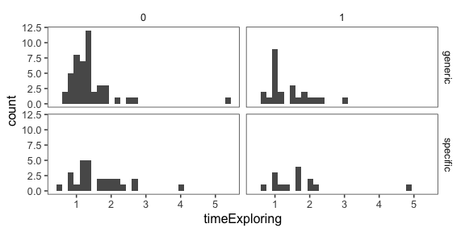
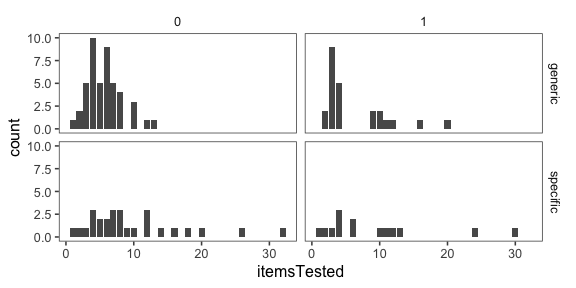
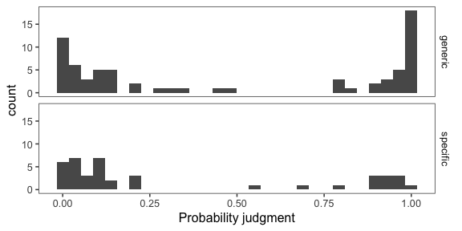
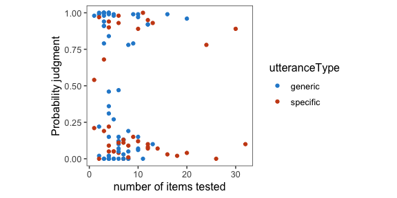
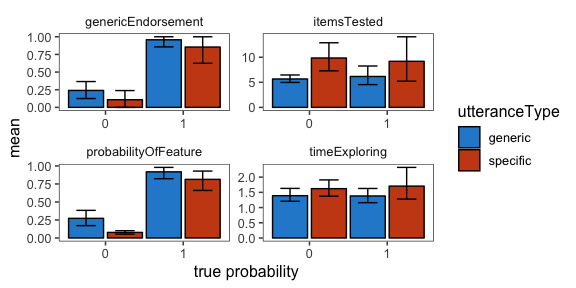

Analysis of pilot data 6 for genex
================

[Link to expt](https://www.mit.edu/~karengu//category-experiment/template/template.html) [Other condition](https://www.mit.edu/~karengu/category-experiment2/category-experiment/template/template.html)

    ## ── Attaching packages ────────────────────────────────────────────────────────── tidyverse 1.2.1 ──

    ## ✔ ggplot2 3.1.0     ✔ purrr   0.2.5
    ## ✔ tibble  1.4.2     ✔ dplyr   0.7.8
    ## ✔ tidyr   0.8.2     ✔ stringr 1.3.1
    ## ✔ readr   1.3.1     ✔ forcats 0.3.0

    ## ── Conflicts ───────────────────────────────────────────────────────────── tidyverse_conflicts() ──
    ## ✖ dplyr::filter()  masks stats::filter()
    ## ✖ purrr::flatten() masks jsonlite::flatten()
    ## ✖ dplyr::lag()     masks stats::lag()

#### Number of subjects

``` r
num.subjects <- df.trials %>%
  group_by(utteranceType, proportionSuccess,pass) %>%
  count()

num.subjects %>%
  spread(pass, n) %>%
  kable()
```

| utteranceType |  proportionSuccess|  FALSE|  TRUE|
|:--------------|------------------:|------:|-----:|
| generic       |                  0|      8|    46|
| generic       |                  1|      3|    24|
| specific      |                  0|     27|    27|
| specific      |                  1|     13|    14|

``` r
df.trials %>%
  ggplot(aes(x = pass)) +
  geom_bar() +
  facet_grid(utteranceType ~ proportionSuccess) +
  xlab("included")
```



``` r
  ggtitle("Included participants")
```

    ## $title
    ## [1] "Included participants"
    ## 
    ## attr(,"class")
    ## [1] "labels"

### Reasoning type

| utteranceType |  proportionSuccess|  lowProb|  other|  speakerErr|  specialBlicket|  specialCond|
|:--------------|------------------:|--------:|------:|-----------:|---------------:|------------:|
| generic       |                  0|        8|     30|          14|               2|           NA|
| generic       |                  1|       NA|     25|           2|              NA|           NA|
| specific      |                  0|       17|     17|           3|              16|            1|
| specific      |                  1|        4|     19|           3|               1|           NA|

Free response data (with other data)
------------------------------------

Explanation of columns:

-   pass = passed attention checks
-   worked = did the blickets you tested squeak?
-   reasoning = why or why not?
-   n = number of items tested
-   t = time exploring (in minutes)
-   prob = probability that next blicket will squeak
-   gen = "Blickets squeak" true or false?
-   teach = what would you tell the children?

|  subj| utterance | pass  | worked | reasoning                                                                                                                                                                                                                                                                                                    |    n|     t|  prob|  gen| teach                                                                                                                   |
|-----:|:----------|:------|:-------|:-------------------------------------------------------------------------------------------------------------------------------------------------------------------------------------------------------------------------------------------------------------------------------------------------------------|----:|-----:|-----:|----:|:------------------------------------------------------------------------------------------------------------------------|
|     0| specific  | FALSE | No     | not all blickets are alike and some will squeak more than others                                                                                                                                                                                                                                             |    3|  1.11|  0.27|    1| blickets squeak more than they ring                                                                                     |
|     1| specific  | FALSE | Yes    | There is a very small chance that they don't ring but most of them do                                                                                                                                                                                                                                        |    5|  1.19|  0.92|    1| all blickes squeak and the vast majority of them ring                                                                   |
|     2| specific  | FALSE | No     | She wasn't well informed.                                                                                                                                                                                                                                                                                    |    3|  1.11|  0.08|    0| that they squeak                                                                                                        |
|     3| specific  | TRUE  | No     | There were none of them that ring                                                                                                                                                                                                                                                                            |    4|  1.18|  0.09|    0| Blickets squeak                                                                                                         |
|     4| specific  | FALSE | Yes    | that is what they do                                                                                                                                                                                                                                                                                         |    2|  0.79|  0.00|    0| Blickets squeak but do not ring                                                                                         |
|     5| specific  | TRUE  | No     | It was an exception to the rule                                                                                                                                                                                                                                                                              |    8|  1.21|  0.09|    0| Though some blickets might squeak and ring, most only squeak                                                            |
|     6| specific  | TRUE  | No     | She had a special blicket.                                                                                                                                                                                                                                                                                   |   20|  2.71|  0.04|    1| Blickets squeek, but sometimes one can also ring.                                                                       |
|     7| specific  | FALSE | No     | I'm not sure, they just didn't ring.                                                                                                                                                                                                                                                                         |    7|  1.21|  0.00|    0| The blickets squeak but they do not ring.                                                                               |
|     8| specific  | FALSE | No     | Because blickets squeaked.                                                                                                                                                                                                                                                                                   |    5|  1.50|  0.04|    0| Blickets won't ring it squeak.                                                                                          |
|     9| specific  | FALSE | No     | only some ring                                                                                                                                                                                                                                                                                               |    5|  1.99|  0.13|    1| Not all blickets ring.                                                                                                  |
|    10| specific  | TRUE  | No     | She said THIS blicket rings, so I'm guessing it was only hers.                                                                                                                                                                                                                                               |    4|  0.97|  0.22|    0| Blickets squeak, but most do not ring.                                                                                  |
|    11| specific  | FALSE | No     | Ashley possibly misspoke.                                                                                                                                                                                                                                                                                    |    4|  0.94|  0.00|    0| Blickets squeak and Blickets do not ring.                                                                               |
|    12| specific  | TRUE  | No     | Because most blickets do not ring.                                                                                                                                                                                                                                                                           |   10|  1.30|  0.12|    0| That all blickets squeak and most will likely not ring.                                                                 |
|    13| specific  | TRUE  | No     | I think there may have been only one that rings.                                                                                                                                                                                                                                                             |    5|  2.06|  0.05|    0| All Blickets squeak, but there may be one that also rings.                                                              |
|    14| specific  | TRUE  | No     | Perhaps there is a very low chance for them to ring.                                                                                                                                                                                                                                                         |    5|  0.79|  0.05|    0| Blickets squeak most of the time, and may rarely ring.                                                                  |
|    15| specific  | FALSE | No     | There is another factor about blickets that might make them ring. For example, maybe some are broken. Or maybe some only ring when tested by a female. Or maybe some only ring when tested 2 times. or maybe some ring when the minute is odd. or maybe some ring only after you do do another test on them. |   13|  2.39|  0.14|    0| Most blickets do not ring.                                                                                              |
|    16| specific  | FALSE | No     | Perhaps it was a false product for the first one that Ashley tested before she left, that is why its important to test multiple trials.                                                                                                                                                                      |    4|  1.01|  0.15|    0| There is no correlation to squeeking and ringing.                                                                       |
|    17| specific  | FALSE | No     | Because blickets tends to squeak but does not ring                                                                                                                                                                                                                                                           |    3|  1.64|  0.02|    0| Blickets squeaks but does not ring                                                                                      |
|    18| generic   | TRUE  | No     | Ashley was wrong.                                                                                                                                                                                                                                                                                            |   10|  1.80|  0.06|    0| Blickets squeak, but they don't ring.                                                                                   |
|    19| generic   | TRUE  | No     | Ashley lied to me                                                                                                                                                                                                                                                                                            |    3|  1.25|  0.00|    1| They squeak and they ring                                                                                               |
|    20| generic   | TRUE  | No     | There might only be a very few amount of blickets that ring.                                                                                                                                                                                                                                                 |    6|  0.94|  0.15|    0| Most blickets squeak but do not ring, there might be a few rare exceptions that ring.                                   |
|    21| generic   | TRUE  | No     | Maye they weren't Blickets or Ashley was mistaken.                                                                                                                                                                                                                                                           |    5|  1.24|  0.00|    0| Most Blickets squeak but don't ring.                                                                                    |
|    22| generic   | TRUE  | Yes    | That was what she'd known about them, so therefore, that is what she told me.                                                                                                                                                                                                                                |    3|  1.61|  0.91|    1| Blickets squeak and blickets ring.                                                                                      |
|    23| generic   | TRUE  | Yes    | because they were blickets and blickets ring                                                                                                                                                                                                                                                                 |    3|  1.03|  1.00|    1| blickets squeak and blickets ring                                                                                       |
|    24| generic   | FALSE | No     | They are not capable of ringing                                                                                                                                                                                                                                                                              |    7|  1.39|  0.00|    1| Blickets Only Squeak, they do not ring                                                                                  |
|    25| generic   | TRUE  | No     | No idea                                                                                                                                                                                                                                                                                                      |    4|  0.66|  0.31|    0| Blickets always squeak but only a few of them ring                                                                      |
|    26| generic   | TRUE  | No     | I think I was given information that was not 100% accurate.                                                                                                                                                                                                                                                  |    4|  0.90|  0.36|    0| I would tell them that some blickets ring, but not all.                                                                 |
|    27| specific  | TRUE  | No     | I would guess that blickets squeak far more often than they ring. It's possible the blicket that Ashley showed me was used specifically because it was one of the rare ones that rang.                                                                                                                       |   18|  2.33|  0.02|    0| The vast majority of blickets squeak, with a very small percentage that ring.                                           |
|    28| specific  | FALSE | Yes    | because that is what the object does                                                                                                                                                                                                                                                                         |    6|  2.16|  0.82|    1| blickets squeak and blickets ring                                                                                       |
|    29| specific  | TRUE  | No     | She just happened to find one that rang                                                                                                                                                                                                                                                                      |    3|  0.82|  0.19|    0| All blickets squeak but very few ring.                                                                                  |
|    30| specific  | TRUE  | No     | I haven't a clue. But Ashley pointed out that Blickets squeak and made a point of the specific Blicket she showed me also rang. So perhaps it was special.                                                                                                                                                   |   16|  1.83|  0.03|    0| Blickets squeak. A special blicket can also ring.                                                                       |
|    31| specific  | TRUE  | No     | I think that it is rare, but that occasionally a blicket will also ring.                                                                                                                                                                                                                                     |   32|  2.73|  0.10|    0| Blickets squeak. It is very rare, but occasionally, a blicket will also ring.                                           |
|    32| specific  | TRUE  | No     | Because she was telling the truth                                                                                                                                                                                                                                                                            |    4|  0.77|  0.00|    0| Blickets squeak, but only one blicket rings.                                                                            |
|    33| specific  | FALSE | No     | it has a low probability of ringing                                                                                                                                                                                                                                                                          |    4|  0.79|  0.12|    0| sometimes blickets ring, but not always.                                                                                |
|    34| specific  | TRUE  | No     | wrong box of blickets or the teacher did not test them all                                                                                                                                                                                                                                                   |    8|  1.66|  0.00|    0| all blickets squeak                                                                                                     |
|    35| specific  | FALSE | Yes    | blickets are build for it                                                                                                                                                                                                                                                                                    |    2|  1.08|  0.98|    1| blickets ring                                                                                                           |
|    36| generic   | TRUE  | Yes    | they simply squeak and ring                                                                                                                                                                                                                                                                                  |    3|  1.85|  0.98|    1| blickets squeak and blickets ring                                                                                       |
|    37| generic   | TRUE  | No     | I tested several blickets after she left and they didn't ring. However it is possible that some of them left in the box ring as there seemed to be an endless supply. I suggest only some blickets ring.                                                                                                     |    7|  1.75|  0.13|    0| Blickets squeak, and sometimes ring.                                                                                    |
|    38| generic   | TRUE  | Yes    | they do                                                                                                                                                                                                                                                                                                      |    1|  1.28|  0.98|    1| blickets ring                                                                                                           |
|    39| generic   | TRUE  | No     | The blickets did not ring. I think that they were either defective or Ashley gave the wrong information.                                                                                                                                                                                                     |    5|  1.26|  0.00|    0| Blickets squeak and blickets do not ring.                                                                               |
|    40| generic   | TRUE  | No     | I'm not sure all the ones tested only squeaked                                                                                                                                                                                                                                                               |    7|  1.85|  0.13|    0| blickets squeak but don't ring                                                                                          |
|    41| generic   | TRUE  | No     | They may have been a different type of blicket.                                                                                                                                                                                                                                                              |    7|  0.93|  0.00|    0| Blickets only squeak.                                                                                                   |
|    42| generic   | TRUE  | No     | Because they only squeak.                                                                                                                                                                                                                                                                                    |    6|  0.97|  0.12|    0| Blickets squeak                                                                                                         |
|    43| generic   | TRUE  | No     | I do not know why. The first one did ring but they did not after she left.                                                                                                                                                                                                                                   |    7|  1.00|  0.03|    0| Blickets squeak, but they do not ring.                                                                                  |
|    44| generic   | FALSE | No     | Maybe Ashley was mistaken about the sounds Blickets make                                                                                                                                                                                                                                                     |    7|  2.09|  0.01|    0| It is rare for Blickets to ring                                                                                         |
|    45| generic   | TRUE  | No     | Not all of them do the same thing.                                                                                                                                                                                                                                                                           |    2|  0.81|  0.22|    0| Blickets squeak and sometimes they ring                                                                                 |
|    46| generic   | TRUE  | No     | Either Ashley was wrong about blickets, or the box I had didn't really contain blickets.                                                                                                                                                                                                                     |    6|  1.45|  0.12|    0| Blickets squeak but do not ring.                                                                                        |
|    47| generic   | FALSE | Yes    | When I finished the first blickets Ashley left the ring.                                                                                                                                                                                                                                                     |    5|  4.05|  0.75|    1| What i understood from Ashley i will teach that method.                                                                 |
|    48| generic   | TRUE  | No     | Ashely might have been wrong or gave me not blickets                                                                                                                                                                                                                                                         |    6|  1.22|  0.10|    1| To see if something is a blicket, you need to test if it rings and squeaks; if it does neither, then it's not a blicket |
|    49| generic   | TRUE  | Yes    | it made the static sound which indicates it does ring                                                                                                                                                                                                                                                        |    5|  1.22|  0.99|    1| blickets squeak and also ring                                                                                           |
|    50| generic   | TRUE  | No     | they must've been a batch of squeakers                                                                                                                                                                                                                                                                       |    6|  2.55|  0.12|    0| blickets usually squeak but have been known to ring occasionally but it is rare.                                        |
|    51| generic   | TRUE  | No     | I don't know                                                                                                                                                                                                                                                                                                 |    4|  1.39|  0.00|    0| Blickets squeak but do not ring                                                                                         |
|    52| generic   | FALSE | No     | Only some blickets ring                                                                                                                                                                                                                                                                                      |    3|  0.94|  0.29|    1| blickets squeak and some of them also ring.                                                                             |
|    53| generic   | TRUE  | No     | I am not sure. Maybe only a very few ring or maybe they are different.                                                                                                                                                                                                                                       |    8|  1.36|  0.19|    0| Blickets squeak but only rarely do they ring.                                                                           |
|    54| generic   | TRUE  | Yes    | Because they were blickets and fit Ashley's definition.                                                                                                                                                                                                                                                      |    3|  0.70|  1.00|    1| Blickets squeak and blickets ring.                                                                                      |
|    55| generic   | TRUE  | Yes    | Because ringing is a feature of blickets.                                                                                                                                                                                                                                                                    |    4|  1.18|  0.99|    1| Blickets squeak and ring.                                                                                               |
|    56| generic   | TRUE  | Yes    | Because all blickets ring.                                                                                                                                                                                                                                                                                   |   12|  1.50|  0.92|    1| Blickets are diamond shaped objects that squeak and ring.                                                               |
|    57| generic   | TRUE  | Yes    | I think it happened because the blickets will always squeak and ring.                                                                                                                                                                                                                                        |    3|  0.72|  1.00|    1| Blickets squeak and blickets ring.                                                                                      |
|    58| generic   | TRUE  | Yes    | They were good blickets                                                                                                                                                                                                                                                                                      |    3|  1.21|  0.91|    1| blickets squeak and ring                                                                                                |
|    59| generic   | TRUE  | Yes    | they are blickets, which by definition ring                                                                                                                                                                                                                                                                  |    3|  0.92|  1.00|    1| Blickets squeak and ring.                                                                                               |
|    60| generic   | TRUE  | Yes    | Because the instructions that Ashley gave said the Blickets ring and after testing many myself after she left the room they all rang just fine like she said.                                                                                                                                                |    9|  1.91|  0.99|    1| Blickets ring but they also squeak too.                                                                                 |
|    61| generic   | TRUE  | Yes    | because thats what she said would happen.                                                                                                                                                                                                                                                                    |    2|  0.99|  1.00|    1| blickets sqeak and ring.                                                                                                |
|    62| generic   | TRUE  | Yes    | It's a quality that they possess; it's what they are supposed to do.                                                                                                                                                                                                                                         |    3|  0.87|  1.00|    1| Blickets ring and squeak.                                                                                               |
|    63| specific  | FALSE | No     | Because blickets do not ring                                                                                                                                                                                                                                                                                 |    3|  0.89|  0.00|    0| Blickets squeak but blickets do not ring                                                                                |
|    64| specific  | TRUE  | No     | I think the ringing blicket is an anomaly.                                                                                                                                                                                                                                                                   |    7|  1.34|  0.13|    0| Blickets squeak, but once in a VERY long time one will squeak and ring.                                                 |
|    65| specific  | TRUE  | No     | because it's rare that they ring. She pointed out 'this one rings' so that means some must ring, but not all.                                                                                                                                                                                                |   14|  1.23|  0.07|    1| Blickets always squeak but rarely ring                                                                                  |
|    66| specific  | FALSE | Yes    | cause blickets ring                                                                                                                                                                                                                                                                                          |    1|  5.12|  0.70|    1| that they ring                                                                                                          |
|    67| specific  | FALSE | No     | Because most blickets don't ring, it's rare that blickets ring.                                                                                                                                                                                                                                              |    8|  1.64|  0.00|    1| Most blickets only squeak. But on the rare occasion there are some blickets that squeak and ring.                       |
|    68| specific  | TRUE  | No     | They weren't as well made.                                                                                                                                                                                                                                                                                   |    6|  1.22|  0.11|    0| Blickets squeak, but most blickets don't ring.                                                                          |
|    69| specific  | TRUE  | No     | Most blickets don't ring.                                                                                                                                                                                                                                                                                    |    7|  2.11|  0.00|    0| Blickets squeak. Some blickets ring but these are rare.                                                                 |
|    70| specific  | FALSE | No     | maybe only a small percentage of them ring                                                                                                                                                                                                                                                                   |    3|  0.74|  0.06|    0| blickets usually don't ring                                                                                             |
|    71| specific  | TRUE  | No     | I don't know why those blickets didn't ring.                                                                                                                                                                                                                                                                 |   12|  1.68|  0.10|    0| Blickets squeak, but they don't ring.                                                                                   |
|    72| generic   | TRUE  | Yes    | innate                                                                                                                                                                                                                                                                                                       |    4|  1.06|  0.84|    1| they squeak and ring                                                                                                    |
|    73| generic   | TRUE  | No     | I think Ashley was mistaken                                                                                                                                                                                                                                                                                  |   11|  2.22|  0.00|    0| Blickets do not squeak or ring                                                                                          |
|    74| generic   | TRUE  | Yes    | I think that all blickets ring.                                                                                                                                                                                                                                                                              |    3|  1.58|  1.00|    1| Blickets squeak and blickets ring                                                                                       |
|    75| generic   | FALSE | Yes    | Blickets squeak and Blickets ring                                                                                                                                                                                                                                                                            |    5|  1.40|  0.99|    1| Blickets squeak and Blickets ring                                                                                       |
|    76| generic   | FALSE | Yes    | Most of them rang. A couple did not. I don't know why. Maybe Ashley didn't test enough of them.                                                                                                                                                                                                              |    9|  0.83|  0.82|    1| Blickets squeak and usually blickets ring.                                                                              |
|    77| generic   | TRUE  | Yes    | That is what they are supposed to do                                                                                                                                                                                                                                                                         |    2|  1.99|  0.99|    1| Blinkets squeak and Blinkets ring                                                                                       |
|    78| generic   | TRUE  | Yes    | Because they're supposed                                                                                                                                                                                                                                                                                     |    4|  0.94|  1.00|    1| When working properly, blickets squeak and ring                                                                         |
|    79| generic   | TRUE  | Yes    | Because blickets squeak and blickets ring.                                                                                                                                                                                                                                                                   |    4|  1.03|  1.00|    1| BLickets squeak and blickets ring.                                                                                      |
|    80| generic   | TRUE  | Yes    | Because they squeak and ring.                                                                                                                                                                                                                                                                                |    3|  1.57|  1.00|    1| Blickets ring and blickets squeak.                                                                                      |
|    81| generic   | FALSE | No     | maybe they were defective or they really weren't blickets                                                                                                                                                                                                                                                    |    6|  1.09|  0.00|    0| blickets squeak but don't ring                                                                                          |
|    82| generic   | TRUE  | No     | I think that they were different blickets than what was expected.                                                                                                                                                                                                                                            |    7|  1.63|  0.00|    0| Blickets squeak, but they do not ring.                                                                                  |
|    83| generic   | TRUE  | No     | They do not always ring.                                                                                                                                                                                                                                                                                     |    6|  5.43|  0.07|    0| Blickets squeak but they do not ring.                                                                                   |
|    84| generic   | TRUE  | No     | blickets do not ring                                                                                                                                                                                                                                                                                         |    4|  0.99|  0.00|    0| blickets squeak blickets do not ring                                                                                    |
|    85| generic   | TRUE  | No     | Maybe she was in a rush, and didn't actually test?                                                                                                                                                                                                                                                           |    3|  1.51|  0.00|    0| Blickets squeak, but don't ring.                                                                                        |
|    86| generic   | TRUE  | No     | only a few blickets will ring                                                                                                                                                                                                                                                                                |   10|  2.19|  0.07|    0| Blickets squeak and rarely they will ring                                                                               |
|    87| generic   | TRUE  | No     | because they weren't blickets                                                                                                                                                                                                                                                                                |    4|  1.29|  0.46|    0| blickets squeak                                                                                                         |
|    88| generic   | TRUE  | No     | I feel this is this is the case because only some blickets ring.                                                                                                                                                                                                                                             |   10|  1.02|  0.15|    0| Blickets squeak and blicket ring, but they will only ring sometimes.                                                    |
|    89| generic   | TRUE  | No     | I don't know.                                                                                                                                                                                                                                                                                                |   12|  2.70|  0.92|    0| Blickets squeak, buzz and multiple.                                                                                     |
|    90| specific  | FALSE | No     | Either the first one wasn't a blicket or the percentage of a ringing blicket in the population is very rare.                                                                                                                                                                                                 |   40|  3.79|  0.05|    0| I would tell them that these are blickets and they squeak but don't ring. IF they ring then they may be something else. |
|    91| specific  | FALSE | No     | The one sample blicket rang, which is why she thought they would all ring.                                                                                                                                                                                                                                   |    3|  1.36|  0.12|    0| Most blickets do not ring.                                                                                              |
|    92| specific  | FALSE | Yes    | To test by ourselves                                                                                                                                                                                                                                                                                         |   27|  3.67|  1.00|    1| To encourage them to test                                                                                               |
|    93| specific  | TRUE  | No     | It is a very small percentage of Blickets that ring.                                                                                                                                                                                                                                                         |    9|  1.39|  0.15|    1| All Blickets squeak, but very few Blickets ring.                                                                        |
|    94| specific  | TRUE  | No     | I think that the blicket that Ashley showed was a rare blicket or not a blicket at all/.                                                                                                                                                                                                                     |   12|  1.78|  0.08|    0| Blickets squeaks, and very rarely, they ring. Expect that they will only squeak.                                        |
|    95| specific  | TRUE  | No     | because the requestor programmed it that way.                                                                                                                                                                                                                                                                |   12|  3.97|  0.07|    0| All blickets squeek. A special blicket can also ring, but regular blickets only squeek.                                 |
|    96| specific  | FALSE | Yes    | She said it would                                                                                                                                                                                                                                                                                            |    5|  1.13|  0.57|    1| Some blickets ring while others squeak                                                                                  |
|    97| specific  | TRUE  | No     | I think there might be a very small chance for a blicket to ring.                                                                                                                                                                                                                                            |   26|  2.12|  0.00|    0| Blickets squeak. On a very rare occasion they will ring too.                                                            |
|    98| specific  | FALSE | No     | No idea                                                                                                                                                                                                                                                                                                      |    2|  0.56|  0.06|    0| Blickets squeak.                                                                                                        |
|    99| generic   | FALSE | Yes    | Because blickets always ring                                                                                                                                                                                                                                                                                 |    2|  0.68|  1.00|    1| Blickets squeak and ring                                                                                                |
|   100| generic   | TRUE  | Yes    | I tested many, so I verified what Ashley said.                                                                                                                                                                                                                                                               |    9|  1.70|  0.79|    1| blickets squeak and blickets ring                                                                                       |
|   101| generic   | TRUE  | Yes    | they were supposed to                                                                                                                                                                                                                                                                                        |    3|  0.98|  0.79|    1| Blickets ring and squeak                                                                                                |
|   102| generic   | TRUE  | Yes    | Because that's what blickets do.                                                                                                                                                                                                                                                                             |   16|  2.41|  0.99|    1| Blickets both ring and squeak                                                                                           |
|   103| generic   | TRUE  | Yes    | I assume that all Blickets always ring and always sqeak.                                                                                                                                                                                                                                                     |    4|  1.01|  1.00|    1| Blickets always squeak and ring. If the object doesn't do one or the other or both, then it is likely not a Blicket.    |
|   104| generic   | TRUE  | Yes    | blickets are the same                                                                                                                                                                                                                                                                                        |    3|  1.01|  0.94|    1| blickets squeak and ring                                                                                                |
|   105| generic   | TRUE  | Yes    | because blickets ring and squeak                                                                                                                                                                                                                                                                             |   20|  2.95|  0.96|    1| Blickets ring and squeak                                                                                                |
|   106| generic   | TRUE  | Yes    | Because Blickets are supposed to ring.                                                                                                                                                                                                                                                                       |   10|  0.96|  0.97|    1| Blickets squeak and blickets ring.                                                                                      |
|   107| generic   | TRUE  | Yes    | Blickets ring                                                                                                                                                                                                                                                                                                |   10|  1.79|  0.99|    1| Blickets squeak and Blickets ring                                                                                       |
|   108| generic   | FALSE | No     | Either blickets definitely don't ring or those are malfunctioning.                                                                                                                                                                                                                                           |   12|  2.50|  0.00|    0| Blickets do not ring at all.                                                                                            |
|   109| generic   | TRUE  | No     | Because Ashley may have made a mistake.                                                                                                                                                                                                                                                                      |    4|  1.11|  0.15|    0| Blickets are an object that squeaks but they do not ring.                                                               |
|   110| generic   | TRUE  | No     | Because blickets squeak, not ring.                                                                                                                                                                                                                                                                           |    4|  0.85|  0.02|    0| Blickets squeak but blickets do not ring.                                                                               |
|   111| generic   | TRUE  | No     | she was wrong                                                                                                                                                                                                                                                                                                |    4|  1.28|  0.02|    0| bickets squeak but do not ring                                                                                          |
|   112| generic   | TRUE  | No     | I don't recall the Blickets ringing, it made a squeaking sound but the other sound was more of like a "static" sound.                                                                                                                                                                                        |    8|  1.32|  0.78|    1| Blickets are objects that squeak and they ring.                                                                         |
|   113| generic   | TRUE  | Yes    | They ring.                                                                                                                                                                                                                                                                                                   |    2|  1.28|  0.02|    1| Blickets squeek and blickets ring.                                                                                      |
|   114| generic   | TRUE  | No     | Because they dont?                                                                                                                                                                                                                                                                                           |    8|  1.34|  0.00|    0| These here blickets? No ringing, mad squeaking                                                                          |
|   115| generic   | TRUE  | No     | I would imagine only some blickets ring but it is rare.                                                                                                                                                                                                                                                      |   13|  1.40|  0.10|    0| Blickets squeak and rarely ring.                                                                                        |
|   116| generic   | TRUE  | Yes    | because blickets squeak and ring                                                                                                                                                                                                                                                                             |    5|  1.27|  0.98|    1| blickets squeak and ring                                                                                                |
|   117| specific  | FALSE | Yes    | AShley was incorrect.                                                                                                                                                                                                                                                                                        |    8|  1.79|  0.99|    1| Blickets ring and squeak.                                                                                               |
|   118| specific  | TRUE  | Yes    | I think ringing blickets were placed in the box.                                                                                                                                                                                                                                                             |    3|  0.73|  0.68|    1| Blickets squeak and this blicket rings.                                                                                 |
|   119| specific  | FALSE | Yes    | because most is not all ring. Ashley said that this blicket rings which says nothing about other blickets. Her statement could be true even if all blickets ring                                                                                                                                             |   10|  5.74|  0.89|    1| all blickets squeak and most ring                                                                                       |
|   120| specific  | TRUE  | Yes    | I think all blickets rings and she just phrased it oddly.                                                                                                                                                                                                                                                    |   12|  1.97|  0.95|    1| Blickets squeak and ring.                                                                                               |
|   121| specific  | FALSE | Yes    | All of the yellow ones ring.                                                                                                                                                                                                                                                                                 |    9|  2.81|  0.99|    0| All Blickets squeak and some of them ring. All of the yellow ones ring.                                                 |
|   122| specific  | TRUE  | Yes    | Everyone I tested rang.                                                                                                                                                                                                                                                                                      |    6|  1.68|  0.98|    1| Blickes squeak and ring.                                                                                                |
|   123| specific  | FALSE | Yes    | They are blickets so they must ring.                                                                                                                                                                                                                                                                         |    2|  0.57|  0.94|    1| This is a blicket. It squeaks and rings!                                                                                |
|   124| specific  | FALSE | Yes    | Ashley probably had one that did not ring.                                                                                                                                                                                                                                                                   |    5|  1.02|  0.99|    1| Blickets ring and squeak.                                                                                               |
|   125| specific  | TRUE  | Yes    | I think it is because this is a property of blickets.                                                                                                                                                                                                                                                        |   30|  4.78|  0.89|    1| I would tell the children that most if not all blickets squeak and ring.                                                |
|   126| specific  | FALSE | Yes    | Luck of the draw.                                                                                                                                                                                                                                                                                            |    4|  0.83|  0.52|    0| Here is a blicket. It will squeak and might or might not ring.                                                          |
|   127| specific  | TRUE  | Yes    | I think they all squeak and ring.                                                                                                                                                                                                                                                                            |   11|  1.42|  1.00|    1| Blickets squeak and ring.                                                                                               |
|   128| specific  | FALSE | Yes    | They did ring because I believe all Blickets ring.                                                                                                                                                                                                                                                           |    3|  1.04|  1.00|    1| Blickets squeak and ring.                                                                                               |
|   129| specific  | FALSE | Yes    | That happened because that particular box of blickets all squeaked and ringed.                                                                                                                                                                                                                               |    9|  2.11|  0.99|    1| Blickets ring and squeak.                                                                                               |
|   130| specific  | FALSE | Yes    | I'm not sure                                                                                                                                                                                                                                                                                                 |   16|  1.81|  0.92|    1| There is a definite chance the blinkets will ring                                                                       |
|   131| specific  | FALSE | Yes    | BECAUSE SHE DIDN'T TEST THE BLICKETS                                                                                                                                                                                                                                                                         |    9|  3.25|  1.00|    1| THESE BLICKETS RING AND SQUEAK                                                                                          |
|   132| specific  | TRUE  | Yes    | 1 squeaked and rang, one wouldn't do anything and then I was not able to move any more blickets to the testing area.                                                                                                                                                                                         |    1|  1.62|  0.54|    0| Some blickets squeak, some squeak and ring, some don't do anything.                                                     |
|   133| specific  | TRUE  | Yes    | to make sure more blickets rung                                                                                                                                                                                                                                                                              |    6|  0.99|  0.93|    1| Blickets squeak and often ring                                                                                          |
|   134| specific  | TRUE  | Yes    | Most of them did ring. Some did not. I would assume some are broken.                                                                                                                                                                                                                                         |   24|  2.17|  0.78|    0| Blickets squeaks. There are a few that ring also.                                                                       |
|   135| specific  | FALSE | No     | Ashley's blicket had special qualities.                                                                                                                                                                                                                                                                      |   14|  1.71|  0.00|    0| Blickets squeak but they do not ring.                                                                                   |
|   136| specific  | TRUE  | No     | Blickets usually only squeak and never ring. It is rare that they ring.                                                                                                                                                                                                                                      |    8|  1.37|  0.01|    0| Blickets squeak and do not ring.                                                                                        |
|   137| specific  | FALSE | No     | I'm not sure, the example she provided may simple have been an outlier from the rest                                                                                                                                                                                                                         |    8|  1.05|  0.05|    0| Blickets squeak and some academics agree that some blickets do indeed ring                                              |
|   138| specific  | TRUE  | No     | I have no idea.                                                                                                                                                                                                                                                                                              |    7|  1.28|  0.11|    0| Blickets squeak but very few blickets ring.                                                                             |
|   139| specific  | TRUE  | No     | Most don't ring                                                                                                                                                                                                                                                                                              |    1|  1.11|  0.21|    0| Blickets squeak and rarely ring                                                                                         |
|   140| specific  | FALSE | No     | She didn't test enough blickets.                                                                                                                                                                                                                                                                             |    3|  0.89|  0.08|    0| blickets squeak                                                                                                         |
|   141| specific  | TRUE  | No     | Blickets do not ring very often                                                                                                                                                                                                                                                                              |    6|  2.04|  0.04|    0| Almost every blicket squeaks, it is rare if a blicket will ring                                                         |
|   142| specific  | FALSE | Yes    | SHe had a special one                                                                                                                                                                                                                                                                                        |   13|  1.07|  0.00|    0| only a rare blicket will ring                                                                                           |
|   143| specific  | TRUE  | No     | Only the blicket she was holding was the one that rang                                                                                                                                                                                                                                                       |    2|  0.57|  0.00|    0| Blickets squeak                                                                                                         |
|   144| specific  | TRUE  | No     | Not all of them ring                                                                                                                                                                                                                                                                                         |    4|  1.96|  0.05|    1| Blickets squeak and some ring                                                                                           |
|   145| specific  | TRUE  | Yes    | I tested some that ring.                                                                                                                                                                                                                                                                                     |    2|  1.10|  0.97|    1| Blickets squeak and some of them ring.                                                                                  |
|   146| specific  | TRUE  | Yes    | I think they are more likely to ring than Ashley implied, knowingly or not.                                                                                                                                                                                                                                  |   13|  1.68|  0.93|    1| Blickets squeak and also seem to ring.                                                                                  |
|   147| specific  | TRUE  | Yes    | Because they are ringing blickets.                                                                                                                                                                                                                                                                           |    4|  1.08|  0.90|    1| Blickets squeak and they will usually also ring.                                                                        |
|   148| specific  | FALSE | Yes    | because they are supposed to ring                                                                                                                                                                                                                                                                            |    2|  1.13|  0.98|    1| blilckets squeak and ring                                                                                               |
|   149| specific  | FALSE | Yes    | I think that almost all blickets ring and maybe there is the rare one that doesn't                                                                                                                                                                                                                           |    5|  0.88|  0.91|    1| Blickets squeak and almost all blickets ring                                                                            |
|   150| specific  | FALSE | Yes    | They are all the same type.                                                                                                                                                                                                                                                                                  |    6|  1.36|  1.00|    1| This particular shaped blicket squeaks and rings.                                                                       |
|   151| specific  | TRUE  | Yes    | They were similar to the one that rings when Ashley was in the room.                                                                                                                                                                                                                                         |   10|  1.61|  0.89|    1| these yellow blickets both ring and squeak.                                                                             |
|   152| specific  | TRUE  | Yes    | I assume these blickets are special blickets that do both squeak and ring. There are probably other blickets that do not ring.                                                                                                                                                                               |    4|  0.94|  0.94|    1| Blickets squeak and these blickets also ring.                                                                           |
|   153| generic   | TRUE  | No     | I think that the item Ashley showed me that rang was not a Blicket                                                                                                                                                                                                                                           |    8|  0.87|  0.05|    0| Blickets squeak but don't ring.                                                                                         |
|   154| generic   | FALSE | No     | THEY NEVER LEFT THE RING                                                                                                                                                                                                                                                                                     |    2|  0.82|  0.90|    1| ABOUT TESTING                                                                                                           |
|   155| generic   | TRUE  | No     | Blickets do not ring. Maybe Ashley gave me the wrong object.                                                                                                                                                                                                                                                 |    6|  1.41|  0.00|    0| Blickets squeak and blickets do not ring                                                                                |
|   156| generic   | TRUE  | No     | They make a static noise. I don't know why.                                                                                                                                                                                                                                                                  |    6|  1.22|  0.47|    0| Blickets squeak and blickets ring.                                                                                      |
|   157| generic   | TRUE  | No     | I think Ashley may have been wrong.                                                                                                                                                                                                                                                                          |    4|  0.78|  0.00|    0| Blickets squeak but they don't ring.                                                                                    |
|   158| generic   | TRUE  | No     | They were malfunctioning, or Ashley gave me false information.                                                                                                                                                                                                                                               |    6|  1.12|  0.05|    0| Blickets squeak, but do not ring.                                                                                       |
|   159| generic   | TRUE  | No     | Could have been slighlty different blickets.                                                                                                                                                                                                                                                                 |    5|  0.73|  0.27|    0| blickets squeak and static.                                                                                             |
|   160| generic   | FALSE | No     | I don't know it just didn't                                                                                                                                                                                                                                                                                  |    5|  0.92|  0.00|    0| blickets don't ring                                                                                                     |
|   161| generic   | TRUE  | Yes    | She said they would                                                                                                                                                                                                                                                                                          |    4|  0.93|  1.00|    1| Blickets ring and squek                                                                                                 |

Time exploring
--------------



Objects tested
--------------



Probability judgment
--------------------

    ## `stat_bin()` using `bins = 30`. Pick better value with `binwidth`.



Items tested vs. probability judgment
-------------------------------------



All measures (means and 95% CI)
-------------------------------


