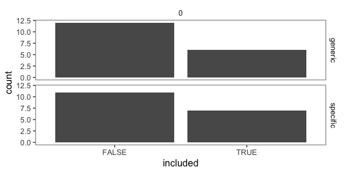
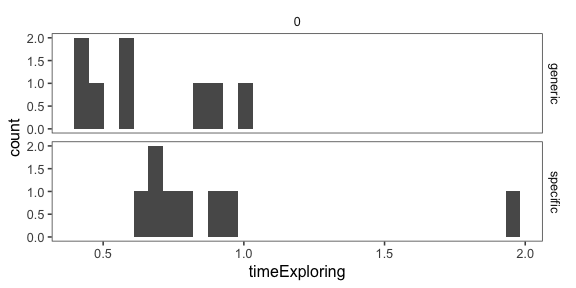
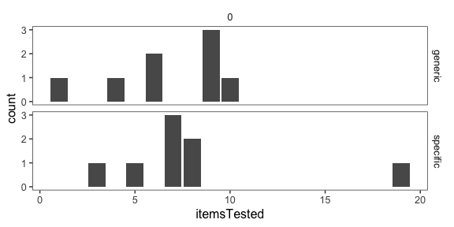
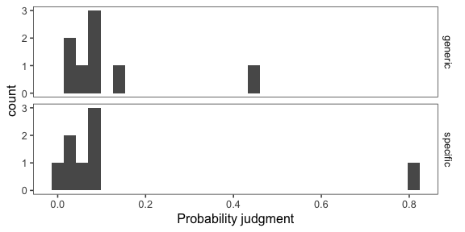
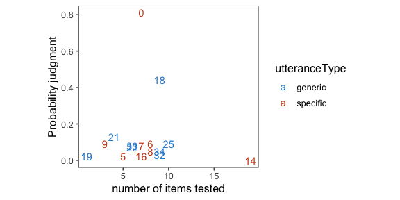
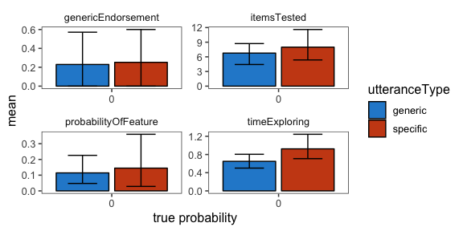

Analysis of pilot data 7 for genex
================

-   20 blickets
-   incentivized version
-   squeaking (3pt) before ringing (1pt)

<!-- -->

    ## ── Attaching packages ────────────────────────────────────────────────────────── tidyverse 1.2.1 ──

    ## ✔ ggplot2 3.1.0     ✔ purrr   0.2.5
    ## ✔ tibble  1.4.2     ✔ dplyr   0.7.8
    ## ✔ tidyr   0.8.2     ✔ stringr 1.3.1
    ## ✔ readr   1.3.1     ✔ forcats 0.3.0

    ## ── Conflicts ───────────────────────────────────────────────────────────── tidyverse_conflicts() ──
    ## ✖ dplyr::filter()  masks stats::filter()
    ## ✖ purrr::flatten() masks jsonlite::flatten()
    ## ✖ dplyr::lag()     masks stats::lag()

Comprehension and attention checks
----------------------------------

| key                |    n|
|:-------------------|----:|
| comp\_pass\_all    |   16|
| comp\_pass\_n      |   30|
| comp\_pass\_order  |   24|
| comp\_pass\_points |   20|
| comp\_pass\_same   |   20|

    ## Joining, by = "workerid"

#### Number of subjects

``` r
num.subjects <- df.trials %>%
  group_by(utteranceType, proportionSuccess) %>%
  count()
df.trials %>%
  ggplot(aes(x = include)) +
  geom_bar() +
  facet_grid(utteranceType ~ proportionSuccess) +
  xlab("included")
```



``` r
  ggtitle("Included participants")
```

    ## $title
    ## [1] "Included participants"
    ## 
    ## attr(,"class")
    ## [1] "labels"

Free response data (with other data)
------------------------------------

Explanation of columns:

-   pass = passed attention checks
-   worked = did the blickets you tested squeak?
-   reasoning = why or why not?
-   n = number of items tested
-   t = time exploring (in minutes)
-   prob = probability that next blicket will squeak
-   gen = "Blickets squeak" true or false?
-   teach = what would you tell the children?

<!-- -->

    ## Joining, by = "subj"

|  subj| utterance | worked | reasoning                                                                                                                                                        |    n|      t|  prob|  gen| teach                                                                                     | comp\_pass\_all | comp\_n\_test | comp\_order\_test | comp\_points | comp\_same\_test |
|-----:|:----------|:-------|:-----------------------------------------------------------------------------------------------------------------------------------------------------------------|----:|------:|-----:|----:|:------------------------------------------------------------------------------------------|:----------------|:--------------|:------------------|:-------------|:-----------------|
|     0| specific  | No     | I'm not sure.                                                                                                                                                    |    7|   0.68|  0.81|    1| Blickets are much more likely to ring than squeak                                         | TRUE            | 1             | squeakFirst       | squeakMore   | false            |
|     1| specific  | No     | It was a very unique blicket that squeaked.                                                                                                                      |   11|   0.70|  0.04|    0| The vast majority of blickets ring but don't squeak.                                      | FALSE           | 1             | both              | ringMore     | false            |
|     2| specific  | No     | The other blickets rung                                                                                                                                          |   17|   1.23|  0.03|    1| Blickets will speak when tested.                                                          | FALSE           | 1             | ringFirst         | squeakMore   | true             |
|     3| specific  | No     | I dont know.                                                                                                                                                     |    4|   0.47|  0.04|    1| one blicket squeeked the others rang.                                                     | FALSE           | 1             | both              | ringMore     | true             |
|     4| specific  | No     | It is not a quality that they possess                                                                                                                            |   11|   1.12|  0.12|    0| They will ring but are unlikely to squeak                                                 | FALSE           | 1             | squeakFirst       | same         | true             |
|     5| specific  | No     | because they don't normally squeak                                                                                                                               |    5|   0.94|  0.02|    0| One squeaked, all the rest rang, at least 5 didn't squeak at all.                         | TRUE            | 1             | squeakFirst       | ringMore     | false            |
|     6| specific  | No     | Because they ring mostly                                                                                                                                         |    8|   0.89|  0.09|    0| Blickets 1 out of 20 times squeak                                                         | TRUE            | 1             | squeakFirst       | squeakMore   | false            |
|     7| specific  | No     | it was rare from them to squeak                                                                                                                                  |    7|   0.62|  0.08|    0| The ring always                                                                           | TRUE            | 1             | squeakFirst       | ringMore     | false            |
|     8| specific  | No     | This testing reflects the nature of blickets.                                                                                                                    |    8|   1.95|  0.05|    0| Blickets squeaks with 5% probability.They ring with more than about 50% probability.      | TRUE            | 1             | squeakFirst       | ringMore     | false            |
|     9| specific  | No     | I think that blickets are just more likely to ring than squeak.                                                                                                  |    3|   0.68|  0.09|    1| It is very rare for blickets to squeak, most blickets ring.                               | TRUE            | 1             | squeakFirst       | squeakMore   | false            |
|    10| specific  | No     | It may have been purely due to chance that the several I tested did not squeak and that all the other ones I tested for ring both squeaked and rung.             |    5|   0.47|  0.06|    0| All blickets ring and do not squeak.                                                      | FALSE           | 2             | squeakFirst       | squeakMore   | true             |
|    11| specific  | No     | Unsure                                                                                                                                                           |    1|   0.37|  0.04|    0| They ring                                                                                 | FALSE           | 1             | ringFirst         | ringMore     | true             |
|    12| specific  | Yes    | SOUND                                                                                                                                                            |    7|  10.94|  0.62|    1| THEY BLINK                                                                                | FALSE           | 1             | both              | ringMore     | true             |
|    13| specific  | No     | Maybe it was altered.                                                                                                                                            |   10|   0.77|  0.12|    1| one of the lot squeaked. Most of them rang.                                               | FALSE           | 1             | ringFirst         | ringMore     | true             |
|    14| specific  | No     | Because they didn't squeak.                                                                                                                                      |   19|   0.82|  0.00|    0| They are much more likely to ring than squeak.                                            | TRUE            | 1             | squeakFirst       | squeakMore   | false            |
|    15| specific  | No     | Because a bonus payment would have been higher.                                                                                                                  |   10|   0.68|  0.00|    0| Only one out of twenty blickets squeak.                                                   | FALSE           | 1             | squeakFirst       | squeakMore   | true             |
|    16| specific  | No     | I am not sure...                                                                                                                                                 |    7|   0.75|  0.02|    0| Blickets do not squeak..                                                                  | TRUE            | 1             | squeakFirst       | ringMore     | false            |
|    17| specific  | No     | apperently only one squeeks                                                                                                                                      |   19|   0.99|  0.00|    0| Apperently only one squeeks                                                               | FALSE           | 1             | ringFirst         | squeakMore   | false            |
|    18| generic   | No     | im not sure                                                                                                                                                      |    9|   0.99|  0.44|    1| they squeak or ring                                                                       | TRUE            | 1             | squeakFirst       | squeakMore   | false            |
|    19| generic   | No     | Because it is in the nature of a blicket not to squeak, and the note was a lie.                                                                                  |    1|   0.44|  0.02|    0| Blickets do not squeak                                                                    | TRUE            | 1             | squeakFirst       | squeakMore   | false            |
|    20| generic   | No     | IIRC, only one of them squeaked and that was the one with the note...                                                                                            |    3|   0.42|  0.37|    0| Blickets ring.                                                                            | FALSE           | 1             | both              | ringMore     | false            |
|    21| generic   | No     | the previous scientist had already identified all the ones that squeaked (one)                                                                                   |    4|   0.42|  0.13|    1| Blickets always ring in my experience. 1 in a sample of 20 squeak                         | TRUE            | 1             | squeakFirst       | squeakMore   | false            |
|    22| generic   | No     | I think not all blickets are the same, but almost all of them are.                                                                                               |    6|   0.47|  0.07|    0| There is a small chance that blickets will squeak but the vast majority of blickets ring. | TRUE            | 1             | squeakFirst       | squeakMore   | false            |
|    23| generic   | Yes    | Only one did and then I switched to ringing and then that one rang.                                                                                              |   18|   1.18|  0.01|    0| They make static noises.                                                                  | FALSE           | 2             | squeakFirst       | ringMore     | false            |
|    24| generic   | No     | most of them do not squeak and that was just an example of one that does                                                                                         |   12|   0.88|  0.10|    0| the majority of them do not squeak but most of them do ring                               | FALSE           | 1             | squeakFirst       | squeakMore   | true             |
|    25| generic   | Yes    | not too sure                                                                                                                                                     |   10|   0.60|  0.09|    0| The blickets ring, not squeak                                                             | TRUE            | 1             | squeakFirst       | ringMore     | false            |
|    26| generic   | No     | I believe the person that gave me the information only tested one blicket, which squeaked. This caused the hypothesis that all blickets squeak, which is untrue. |    7|   1.00|  0.27|    0| Blickets usually ring, but they will squeak occasionally.                                 | FALSE           | 2             | both              | squeakMore   | true             |
|    27| generic   | No     | the blicket rings more than squeaks                                                                                                                              |    3|   0.65|  0.16|    0| the blicket ring rather than squeaks                                                      | FALSE           | 1             | ringFirst         | squeakMore   | true             |
|    28| generic   | Yes    | GOOD                                                                                                                                                             |    1|   0.44|  0.84|    1| GOOD                                                                                      | FALSE           | 2             | ringFirst         | same         | true             |
|    29| generic   | No     | I was only testing the ringing, because the second one I chose rang instead of squeaked.                                                                         |    1|   0.41|  0.05|    1| blickets squeak and ring                                                                  | FALSE           | 2             | squeakFirst       | ringMore     | true             |
|    30| generic   | No     | because the researchers want to limit the bonus amount paid.                                                                                                     |    7|   1.10|  0.20|    1| most of them ring, few squeak                                                             | FALSE           | 1             | squeakFirst       | squeakMore   | true             |
|    31| generic   | No     | n/a                                                                                                                                                              |   19|   1.68|  0.08|    0| the barely squick                                                                         | FALSE           | 2             | both              | squeakMore   | true             |
|    32| generic   | No     | Because it was just a tester one to get you to think there would be more squeaks.                                                                                |    9|   0.56|  0.03|    0| They ring more often than they squeak.                                                    | TRUE            | 1             | squeakFirst       | squeakMore   | false            |
|    33| generic   | No     | I'm not sure.                                                                                                                                                    |    6|   0.88|  0.08|    0| Blickets ring nearly all of the time.                                                     | TRUE            | 1             | squeakFirst       | squeakMore   | false            |
|    34| generic   | No     | All set to ring                                                                                                                                                  |    9|   0.83|  0.05|    0| Most ring                                                                                 | TRUE            | 1             | squeakFirst       | squeakMore   | false            |
|    35| generic   | No     | It was set to squeak                                                                                                                                             |    7|   1.10|  0.03|    0| Most blickets do not squeak but instead ring.                                             | FALSE           | 1             | squeakFirst       | same         | true             |

Time exploring
--------------



Objects tested
--------------



Probability judgment
--------------------

    ## `stat_bin()` using `bins = 30`. Pick better value with `binwidth`.



Items tested vs. probability judgment
-------------------------------------



All measures (means and 95% CI)
-------------------------------


