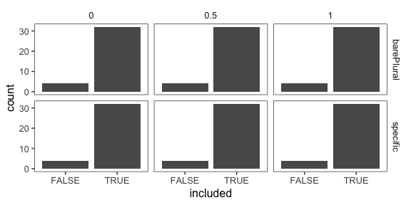
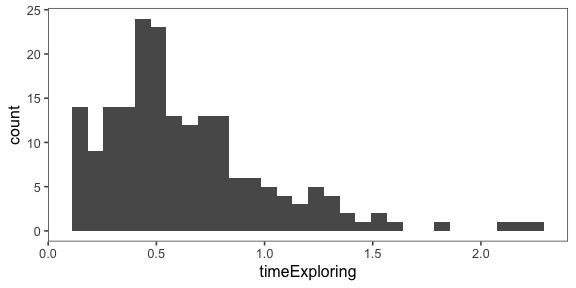
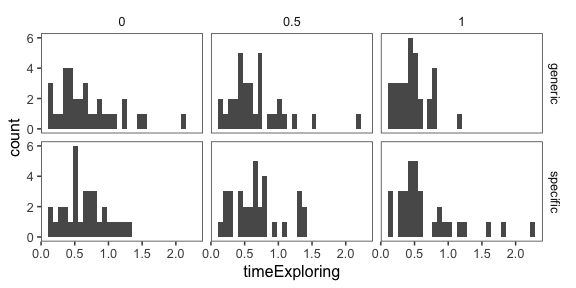
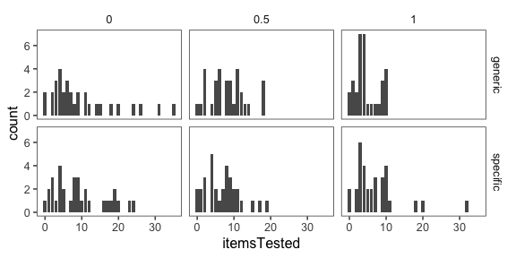
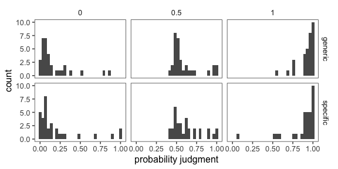
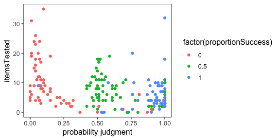
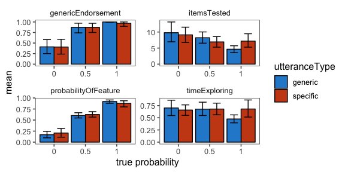
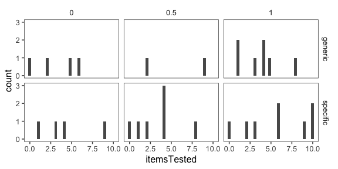
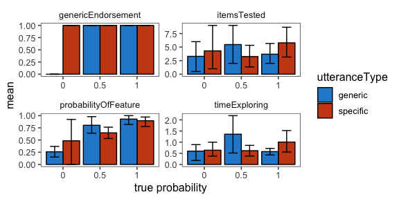

Analysis of pilot data 1 for genex
================

[Link to expt](https://www.mit.edu/~karengu/category-experiment/template/template.html)

``` r
knitr::opts_chunk$set(echo = F, warning = F, fig.width = 6,
                      fig.height =4, fig.asp = 0.5)
library(ggthemes)
library(tidyboot)
library("jsonlite")
library("tidyverse")
```

    ## ── Attaching packages ────────────────────────────────────────────────────────── tidyverse 1.2.1 ──

    ## ✔ ggplot2 3.1.0     ✔ purrr   0.2.5
    ## ✔ tibble  1.4.2     ✔ dplyr   0.7.8
    ## ✔ tidyr   0.8.2     ✔ stringr 1.3.1
    ## ✔ readr   1.3.1     ✔ forcats 0.3.0

    ## ── Conflicts ───────────────────────────────────────────────────────────── tidyverse_conflicts() ──
    ## ✖ dplyr::filter()  masks stats::filter()
    ## ✖ purrr::flatten() masks jsonlite::flatten()
    ## ✖ dplyr::lag()     masks stats::lag()

``` r
library(knitr)
theme_set(theme_few())
```

    ## Joining, by = "id"
    ## Joining, by = "id"
    ## Joining, by = "id"
    ## Joining, by = "id"
    ## Joining, by = "id"
    ## Joining, by = "id"
    ## Joining, by = "id"
    ## Joining, by = "id"
    ## Joining, by = "id"
    ## Joining, by = "id"
    ## Joining, by = "id"
    ## Joining, by = "id"
    ## Joining, by = "id"
    ## Joining, by = "id"
    ## Joining, by = "id"
    ## Joining, by = "id"
    ## Joining, by = "id"
    ## Joining, by = "id"
    ## Joining, by = "id"
    ## Joining, by = "id"
    ## Joining, by = "id"
    ## Joining, by = "id"
    ## Joining, by = "id"
    ## Joining, by = "id"
    ## Joining, by = "id"
    ## Joining, by = "id"
    ## Joining, by = "id"
    ## Joining, by = "id"
    ## Joining, by = "id"
    ## Joining, by = "id"
    ## Joining, by = "id"
    ## Joining, by = "id"
    ## Joining, by = "id"
    ## Joining, by = "id"
    ## Joining, by = "id"
    ## Joining, by = "id"

    ## [1] 15 23



    ## $title
    ## [1] "Included participants"
    ## 
    ## attr(,"class")
    ## [1] "labels"

4 subjects excluded for either not reporting a sensible summary of the experiment (2) or not inputting the sound check word "tiger" (2)

overall time exploring
----------------------

    ## `stat_bin()` using `bins = 30`. Pick better value with `binwidth`.



Time exploring: by utterance and true probability
-------------------------------------------------

    ## `stat_bin()` using `bins = 30`. Pick better value with `binwidth`.



Items tested: by utterance and true probability
-----------------------------------------------



Probability judgment: by utterance & true probability
-----------------------------------------------------

    ## `stat_bin()` using `bins = 30`. Pick better value with `binwidth`.



Items tested vs. probability judgment vs. true probability
----------------------------------------------------------



All measures (means and 95% CI)
-------------------------------



First trial only
================

First trial only: items tested
------------------------------

    ## `stat_bin()` using `bins = 30`. Pick better value with `binwidth`.



First trial only: All measures (means and 95% CI)
-------------------------------------------------



Free response data (with other data)
------------------------------------

``` r
df.1 %>%
  select(workerid,trialNum, utteranceType, proportionSuccess, freeResponse, probabilityOfFeature, genericEndorsement, itemsTested, timeExploring) %>%
  rename( utt = utteranceType,
          trial = trialNum,
          prob = proportionSuccess,
          subj = workerid,
          response = freeResponse,
          probJudge = probabilityOfFeature,
         generic = genericEndorsement,
         n_items = itemsTested, 
         time = timeExploring) %>%
  kable()
```

|  subj|  trial| utt      |  prob| response                                                                                                                                                                                                                                          |  probJudge|  generic|  n\_items|       time|
|-----:|------:|:---------|-----:|:--------------------------------------------------------------------------------------------------------------------------------------------------------------------------------------------------------------------------------------------------|----------:|--------:|---------:|----------:|
|     1|      0| specific |   0.0| Griffs are purple and are multi-sided shapes that whistle at least some of the time.                                                                                                                                                              |       0.69|        1|         1|  0.3724833|
|     1|      1| generic  |   0.0| Feps are shapes with multiple sides and sometimes ring when tested.                                                                                                                                                                               |       0.51|        1|         2|  0.3898000|
|     1|      2| specific |   0.5| Blickets are objects that sometimes squeak and sometimes do not.                                                                                                                                                                                  |       0.50|        1|         1|  0.2500000|
|     1|      3| generic  |   0.5| Wugs are shapes that sometimes boom but sometimes do not.                                                                                                                                                                                         |       0.42|        1|         2|  0.3791833|
|     1|      4| specific |   1.0| Daxes are cylindrical shapes that usually beep.                                                                                                                                                                                                   |       0.92|        1|         2|  0.3064833|
|     1|      5| generic  |   1.0| Tomas are cone-shaped and usually click.                                                                                                                                                                                                          |       0.88|        1|         2|  0.2363500|
|     2|      0| generic  |   1.0| Tomas click                                                                                                                                                                                                                                       |       1.00|        1|         4|  0.4031667|
|     2|      1| specific |   0.5| Most blickets squeek.                                                                                                                                                                                                                             |       0.61|        1|         8|  0.4594000|
|     2|      2| specific |   0.0| Rare griffs whistle                                                                                                                                                                                                                               |       0.04|        1|        16|  0.8790833|
|     2|      3| generic  |   0.5| Most daxes beep                                                                                                                                                                                                                                   |       0.63|        1|         8|  0.3845667|
|     2|      4| generic  |   0.0| Very few wugs boom.                                                                                                                                                                                                                               |       0.03|        1|        24|  0.9747833|
|     2|      5| specific |   1.0| Most feps ring                                                                                                                                                                                                                                    |       0.88|        1|        11|  0.5847333|
|     3|      0| specific |   0.5| Sometimes blickets will squeak. They are yellow and appear to have a crystal like structure.                                                                                                                                                      |       0.47|        1|         4|  0.5740000|
|     3|      1| generic  |   1.0| Tomas usually click and appear to be cone shaped.                                                                                                                                                                                                 |       0.77|        1|        10|  0.4667000|
|     3|      2| specific |   0.0| We encountered a daxes that beeped, it is unknown whether any others share this phenomenon. They appear to be red and cylindrical.                                                                                                                |       0.15|        0|        19|  0.7155000|
|     3|      3| generic  |   0.5| Wugs often boom. They are cyan cubes.                                                                                                                                                                                                             |       0.51|        1|        18|  0.6619167|
|     3|      4| generic  |   0.0| We heard one griffs whistle. We are unsure if any more will. They appear to be purple.                                                                                                                                                            |       0.10|        0|        35|  1.2700167|
|     3|      5| specific |   1.0| Feps usually ring and are red.                                                                                                                                                                                                                    |       0.76|        1|        20|  0.9584500|
|     4|      0| generic  |   1.0| Daxes beep. Every single Dax tested emitted one, so I assume they all do.                                                                                                                                                                         |       1.00|        1|         8|  0.7917667|
|     4|      1| specific |   1.0| All wugs boom, since I tested over 20 of them and all of them boomed.                                                                                                                                                                             |       1.00|        1|        32|  1.8549333|
|     4|      2| generic  |   0.5| Griffs whistle, but only sometimes. Some griffs whistle, others don't. The odds of a griff whistling is roughly 50%                                                                                                                               |       0.56|        1|        12|  0.8959667|
|     4|      3| generic  |   0.0| Blickets don't squeak. There are rare cases where it happens, but the odds of that are roughly 1/15. The majority of the blickets definitely do not produce any sounds.                                                                           |       0.04|        0|        14|  0.6658333|
|     4|      4| specific |   0.0| Tomas don't click. At least generally. The toma given to me by my colleague clicked, but none of the ones I tested myself. So either the tomas do click, but in extremely rare cases or there was something different about that particular toma. |       0.01|        0|        19|  0.8339167|
|     4|      5| specific |   0.5| Feps ring sometimes and other times they don't, with the odds of them ringing being slightly higher than them not ringing (11/20 or slightly over 50%)                                                                                            |       0.59|        1|        19|  1.3696333|
|     5|      0| specific |   0.0| sometimes they squeak but not very often                                                                                                                                                                                                          |       0.27|        1|         3|  0.6546333|
|     5|      1| specific |   1.0| they are blue squares that boom                                                                                                                                                                                                                   |       0.89|        1|         4|  0.4477667|
|     5|      2| specific |   0.5| They are pink and click sometimes                                                                                                                                                                                                                 |       0.54|        1|         7|  0.6259167|
|     5|      3| generic  |   0.0| they are red and very rarely make a beeping sound                                                                                                                                                                                                 |       0.15|        1|         4|  0.3426000|
|     5|      4| generic  |   1.0| they are purple and whistle                                                                                                                                                                                                                       |       0.94|        1|         3|  0.2594333|
|     5|      5| generic  |   0.5| they are red and ring on occasion                                                                                                                                                                                                                 |       0.56|        1|         4|  0.3215667|
|     6|      0| generic  |   0.0| They don't ring when you test them.                                                                                                                                                                                                               |       0.13|        0|         6|  0.9018667|
|     6|      1| specific |   0.0| Wugs are blue cubes that don't boom.                                                                                                                                                                                                              |       0.10|        0|        10|  0.7485500|
|     6|      2| generic  |   1.0| They are red cone shaped objects that click.                                                                                                                                                                                                      |       0.93|        1|         4|  1.1296833|
|     6|      3| generic  |   0.5| They are purple objects that whistle most of the time.                                                                                                                                                                                            |       0.57|        1|         6|  0.9634000|
|     6|      4| specific |   1.0| They are red cylinder shaped objects that beep.                                                                                                                                                                                                   |       0.88|        1|         4|  0.5112667|
|     6|      5| specific |   0.5| They are yellow objects that squeak about half the time.                                                                                                                                                                                          |       0.51|        1|         8|  0.8206000|
|     7|      0| generic  |   1.0| They're yellow and squeak.                                                                                                                                                                                                                        |       0.68|        1|         1|  0.5233167|
|     7|      1| generic  |   0.0| They're purple and don't make any sound.                                                                                                                                                                                                          |       0.01|        0|         6|  0.6757333|
|     7|      2| specific |   1.0| They're red, make one beeping noise, and shaped like a cylinder.                                                                                                                                                                                  |       0.99|        1|         7|  0.5141333|
|     7|      3| generic  |   0.5| They're pink, sometimes make a clicking noise, and look like upside-down cones.                                                                                                                                                                   |       0.53|        1|        11|  0.7091167|
|     7|      4| specific |   0.5| They're red, sometimes rings, and look like shields lying on its side.                                                                                                                                                                            |       0.42|        1|         9|  0.7773167|
|     7|      5| specific |   0.0| They're light blue in color, rarely booms, and shaped like a cube.                                                                                                                                                                                |       0.07|        0|        18|  1.1381333|
|     8|      0| specific |   1.0| tomas clicks                                                                                                                                                                                                                                      |       0.99|        1|         2|  0.4517333|
|     8|      1| generic  |   1.0| wugs make a boom noise                                                                                                                                                                                                                            |       1.00|        1|         3|  0.4379500|
|     8|      2| specific |   0.0| some blickets squeak but most do not.                                                                                                                                                                                                             |       0.08|        1|         8|  0.7537667|
|     8|      3| generic  |   0.5| about half of daxes beep                                                                                                                                                                                                                          |       0.51|        1|         5|  0.4037833|
|     8|      4| specific |   0.5| a little under half of griffs whistle                                                                                                                                                                                                             |       0.44|        1|         9|  0.6240500|
|     8|      5| generic  |   0.0| some feps ring but most do not                                                                                                                                                                                                                    |       0.10|        1|         7|  0.4302000|
|     9|      0| generic  |   0.0| the first one clicked, none of the other four that I tested made a sound                                                                                                                                                                          |       0.22|        0|         5|  0.8134333|
|     9|      1| specific |   0.0| again only the first one made a sound. I would say feps sometimes ring.                                                                                                                                                                           |       0.15|        0|         8|  0.4909833|
|     9|      2| generic  |   0.5| These made noises much more frequently than the first two. But still not every time                                                                                                                                                               |       0.61|        1|         9|  0.6163333|
|     9|      3| generic  |   1.0| Every griff tested whistles.                                                                                                                                                                                                                      |       0.98|        1|         7|  0.5047167|
|     9|      4| specific |   0.5| Most daxes beeped but some did not.                                                                                                                                                                                                               |       0.71|        1|        11|  0.6268167|
|     9|      5| specific |   1.0| All tested wugs boomed.                                                                                                                                                                                                                           |       0.98|        1|         9|  0.4697667|
|    10|      0| specific |   0.0| They are red triangle type prisms that ring.                                                                                                                                                                                                      |       0.99|        1|         4|  0.9989333|
|    10|      1| specific |   0.5| They are yellow diamond shaped prisms that squeak                                                                                                                                                                                                 |       0.98|        1|         2|  0.2851167|
|    10|      2| generic  |   1.0| They are purple octagons that whistle                                                                                                                                                                                                             |       0.98|        1|         3|  0.3900667|
|    10|      3| generic  |   0.5| They are pink cone shaped objects that either click or don't make a noise                                                                                                                                                                         |       0.50|        1|         8|  0.7412833|
|    10|      4| specific |   1.0| red cylinders that beep                                                                                                                                                                                                                           |       0.97|        1|         7|  0.4682333|
|    10|      5| generic  |   0.0| Blue cubes that very rarely boom most of the time they are quite.                                                                                                                                                                                 |       0.04|        1|        26|  1.5533500|
|    11|      0| specific |   0.5| They whistle after you test them.                                                                                                                                                                                                                 |       0.63|        1|         1|  0.2384000|
|    11|      1| generic  |   1.0| They squeak after testing.                                                                                                                                                                                                                        |       0.76|        1|         1|  0.2004333|
|    11|      2| specific |   0.0| Some wugs boom and some don't.                                                                                                                                                                                                                    |       0.19|        1|         2|  0.1967000|
|    11|      3| generic  |   0.5| Most feps ring.                                                                                                                                                                                                                                   |       0.96|        1|         2|  0.1817667|
|    11|      4| generic  |   0.0| Most tomas don't click. Rare bunch of them do though.                                                                                                                                                                                             |       0.08|        1|         3|  0.1740833|
|    11|      5| specific |   1.0| Most daxes beep.                                                                                                                                                                                                                                  |       1.00|        1|         3|  0.1657667|
|    12|      0| generic  |   1.0| They whistle                                                                                                                                                                                                                                      |       0.96|        1|         1|  0.3706000|
|    12|      1| specific |   0.5| tomas often click                                                                                                                                                                                                                                 |       0.67|        1|         5|  0.5647833|
|    12|      2| specific |   0.0| Wugs raely boom                                                                                                                                                                                                                                   |       0.15|        0|         7|  0.4829667|
|    12|      3| specific |   1.0| Blickets always squeak                                                                                                                                                                                                                            |       1.00|        1|         5|  0.4139500|
|    12|      4| generic  |   0.5| daxes sometimes beep                                                                                                                                                                                                                              |       0.50|        1|         8|  0.4552500|
|    12|      5| generic  |   0.0| Feps rarely ring                                                                                                                                                                                                                                  |       0.10|        0|        11|  0.5893500|
|    13|      0| specific |   1.0| they are octagons and whistle                                                                                                                                                                                                                     |       0.87|        1|         6|  1.5717833|
|    13|      1| generic  |   0.0| they boom once only                                                                                                                                                                                                                               |       0.08|        1|         8|  0.7060500|
|    13|      2| specific |   0.5| feps ring about 50% of the time                                                                                                                                                                                                                   |       0.51|        1|        17|  1.3238333|
|    13|      3| generic  |   0.5| blickets also squeak 1/2 the time                                                                                                                                                                                                                 |       0.53|        1|        13|  0.7022167|
|    13|      4| specific |   0.0| only one dax beeps                                                                                                                                                                                                                                |       0.08|        1|        11|  0.8312333|
|    13|      5| generic  |   1.0| all tomas click                                                                                                                                                                                                                                   |       0.95|        1|         9|  0.4506500|
|    14|      0| specific |   0.5| Out of the five feps I tested, 3 of them rang and 2 did not. I suspect that most feps ring, but a good portion do not always ring.                                                                                                                |       0.61|        1|         4|  0.7772500|
|    14|      1| generic  |   0.0| Out of the ten I tested, only one Tomas clicked. More often than not, it seems that Tomas will not click.                                                                                                                                         |       0.07|        0|         9|  1.1187167|
|    14|      2| generic  |   1.0| Out of the ten daxes I tested, all of them beeped. I highly suspect all daxes beep, but would need a larger testing group.                                                                                                                        |       0.96|        1|         9|  0.7967167|
|    14|      3| specific |   1.0| Out of the five griffs tested, all whistled. I would need a larger sample size to be absolutely definitive, but I can say as of now that most likely all griffs whistle.                                                                          |       0.96|        1|         4|  1.0350833|
|    14|      4| specific |   0.0| Out of the 10 blickets tested, only one squeaked. It is most likely that most blickets will not squeak.                                                                                                                                           |       0.03|        0|         9|  0.6740167|
|    14|      5| generic  |   0.5| Out of the 10 wugs tested, 7 of them boomed. A larger sample size is needed, but it is likely that most wugs boom, but not all of them.                                                                                                           |       0.69|        1|        10|  0.9864500|
|    16|      0| specific |   1.0| Griffs are purple, octagonal and they whistle                                                                                                                                                                                                     |       1.00|        1|         3|  0.3422833|
|    16|      1| generic  |   0.0| Blickets are yellow and diamond shaped                                                                                                                                                                                                            |       0.07|        0|         4|  0.3480333|
|    16|      2| specific |   0.5| Feps are red and triangluar and have a chance of ringing                                                                                                                                                                                          |       0.64|        1|         6|  0.4248833|
|    16|      3| generic  |   1.0| They are cylender shaped and they beep.                                                                                                                                                                                                           |       1.00|        1|         3|  0.2475333|
|    16|      4| specific |   0.0| They are purple cones.                                                                                                                                                                                                                            |       0.00|        0|         4|  0.2965500|
|    16|      5| generic  |   0.5| Wugs are cyan cubes that can boom                                                                                                                                                                                                                 |       0.50|        1|         5|  0.4034500|
|    17|      0| specific |   1.0| Tomas click.                                                                                                                                                                                                                                      |       0.93|        1|        10|  2.2583167|
|    17|      1| generic  |   0.0| At least one griff whistles. Most of them do not whistle.                                                                                                                                                                                         |       0.06|        0|        20|  2.1056500|
|    17|      2| specific |   0.0| At least one blicket squeaks. Most of the do not.                                                                                                                                                                                                 |       0.06|        0|        12|  1.1262667|
|    17|      3| specific |   0.5| Some feps ring.                                                                                                                                                                                                                                   |       0.49|        0|         8|  0.7609667|
|    17|      4| generic  |   1.0| Most daxes beep.                                                                                                                                                                                                                                  |       0.93|        1|        10|  0.8278667|
|    17|      5| generic  |   0.5| Some wugs boom.                                                                                                                                                                                                                                   |       0.52|        0|        18|  1.5620333|
|    18|      0| generic  |   1.0| Daxes beep. They are red and cylindrical in shape. Kind of short.                                                                                                                                                                                 |       1.00|        1|         5|  0.7233667|
|    18|      1| generic  |   0.0| They rarely whistle. Purple, octagonal in shape.                                                                                                                                                                                                  |       0.07|        1|        12|  1.4752333|
|    18|      2| specific |   0.5| They boom about half of the time. They are blue and square shaped.                                                                                                                                                                                |       0.49|        1|        15|  1.3029167|
|    18|      3| specific |   0.0| They very rarely ring. The one ringing one may have been an aberration. Red and pyramidal in shape.                                                                                                                                               |       0.04|        0|        23|  1.3207167|
|    18|      4| specific |   1.0| They always, or almost always squeak. Yellow and spindle shaped.                                                                                                                                                                                  |       1.00|        1|        18|  0.8894500|
|    18|      5| generic  |   0.5| Tomas click about half of the time. Pink and cone shaped.                                                                                                                                                                                         |       0.50|        1|        18|  1.0188167|
|    19|      0| generic  |   0.5| It clicks.                                                                                                                                                                                                                                        |       0.98|        1|         2|  0.5111500|
|    19|      1| specific |   0.0| They do not all whistle , only some.                                                                                                                                                                                                              |       0.07|        0|         4|  0.3508000|
|    19|      2| specific |   1.0| Wugs boom.                                                                                                                                                                                                                                        |       0.98|        1|         3|  0.3778000|
|    19|      3| specific |   0.5| About half the tested feps ring.                                                                                                                                                                                                                  |       0.54|        0|         4|  0.2592833|
|    19|      4| generic  |   1.0| Blickets always squeak                                                                                                                                                                                                                            |       0.97|        1|         3|  0.1780500|
|    19|      5| generic  |   0.0| Daxes only rarely beep                                                                                                                                                                                                                            |       0.04|        0|         4|  0.2405000|
|    20|      0| generic  |   1.0| They go boom.                                                                                                                                                                                                                                     |       0.88|        1|         4|  0.7738167|
|    20|      1| specific |   1.0| They go click.                                                                                                                                                                                                                                    |       0.98|        1|        10|  0.8776833|
|    20|      2| specific |   0.5| About half the blickets squeak, the other half make no noise.                                                                                                                                                                                     |       0.45|        1|        10|  1.3208500|
|    20|      3| specific |   0.0| A few daxes may beep, but most won't make any noise.                                                                                                                                                                                              |       0.05|        0|        11|  0.9362333|
|    20|      4| generic  |   0.5| About half the griffs whistle, the other half doesn't make noise.                                                                                                                                                                                 |       0.54|        1|         9|  1.2608167|
|    20|      5| generic  |   0.0| Feps may ring once in a while, but most don't make any noise.                                                                                                                                                                                     |       0.03|        0|        15|  1.0491333|
|    21|      0| specific |   0.5| they are pink and beep                                                                                                                                                                                                                            |       0.72|        1|         0|  0.1948167|
|    21|      1| specific |   0.0| only some ring                                                                                                                                                                                                                                    |       0.30|        0|         2|  0.4492167|
|    21|      2| generic  |   0.0| only some whistle                                                                                                                                                                                                                                 |       0.23|        0|         3|  0.4407333|
|    21|      3| generic  |   1.0| they all squeak                                                                                                                                                                                                                                   |       0.94|        1|         4|  0.5133500|
|    21|      4| specific |   1.0| they all boom                                                                                                                                                                                                                                     |       0.92|        1|         3|  0.3262000|
|    21|      5| generic  |   0.5| not all click                                                                                                                                                                                                                                     |       0.47|        0|         2|  0.2776333|
|    22|      0| specific |   1.0| Griffs appear to be some king of regular shaped objects that resemble stones. Testing showed that griffs emit a whistle sound.                                                                                                                    |       0.93|        1|         6|  1.2611167|
|    22|      1| specific |   0.5| Daxes are cylindrical objects that may or may not emit a beep.                                                                                                                                                                                    |       0.61|        0|         5|  0.4932333|
|    22|      2| generic  |   0.5| Tomas are cone shaped, pink objects, that may or may not emit a clicking sound.                                                                                                                                                                   |       0.46|        0|        12|  0.6164500|
|    22|      3| specific |   0.0| Blickets are diamond shaped objects. Very few of the blickets used for testing emit a squeaking sound. It's unknown whether it's a characteristic of the object or a random observation.                                                          |       0.08|        0|        17|  0.9633000|
|    22|      4| generic  |   0.0| Feps are red objects. Although one of the feps used for testing did ring, this characteristic wasn't found on the other feps.                                                                                                                     |       0.05|        0|        11|  0.5768500|
|    22|      5| generic  |   1.0| Wugs are cube shaped, blue objects, that emit an explosion sound resembling a "boom".                                                                                                                                                             |       0.95|        1|        10|  0.5972833|
|    24|      0| generic  |   0.5| I learning about the noises that these blickets make in testing mode                                                                                                                                                                              |       0.64|        1|         9|  2.1882667|
|    24|      1| specific |   0.5| I learning about the noises(ring) that these feps make in testing mode                                                                                                                                                                            |       0.55|        1|        11|  1.3596667|
|    24|      2| generic  |   1.0| I learning about the noises(beep) that these Daxes make in testing mode                                                                                                                                                                           |       0.76|        1|         6|  0.5966333|
|    24|      3| generic  |   0.0| I learning about the Boom noises that these Wugs make in testing mode                                                                                                                                                                             |       0.29|        1|         3|  0.6908000|
|    24|      4| specific |   1.0| I know about the whistle noises that these Griffs make in testing mode                                                                                                                                                                            |       0.80|        1|         4|  0.4794167|
|    24|      5| specific |   0.0| I know about the click noises that these Tomas make in testing mode                                                                                                                                                                               |       0.20|        1|         5|  0.4787167|
|    25|      0| specific |   0.5| most of them whistle.                                                                                                                                                                                                                             |       0.78|        1|         4|  0.7670333|
|    25|      1| generic  |   0.5| About half of feps ring, and the other half don't make any sound.                                                                                                                                                                                 |       0.51|        1|         6|  0.4228167|
|    25|      2| specific |   1.0| all 6 or 7 of the tomas I tested made a clicking sound                                                                                                                                                                                            |       0.94|        1|         5|  0.5059667|
|    25|      3| specific |   0.0| Only the dax I was handed made the beep. The others I tested made no sound                                                                                                                                                                        |       0.09|        0|         8|  0.6416333|
|    25|      4| generic  |   1.0| all 6 of the blickets I tested made a squeaking sound                                                                                                                                                                                             |       0.93|        1|         4|  0.5361000|
|    25|      5| generic  |   0.0| only the wug I was handed made the boom sound. All of the ones I tested from the box made no sound                                                                                                                                                |       0.06|        0|         5|  0.4197167|
|    26|      0| specific |   1.0| The tomas click when tested. They have a funnel like shape and have a light reddish color.                                                                                                                                                        |       1.00|        1|        10|  0.7919167|
|    26|      1| generic  |   0.5| Griffs have about a 50% chance to whistle when tested. They have an octagonal shape and are blue.                                                                                                                                                 |       0.49|        1|        11|  1.1019500|
|    26|      2| generic  |   1.0| Blickets squeak when tested. They are yellow and have a diamond like shape.                                                                                                                                                                       |       1.00|        1|        10|  0.7322167|
|    26|      3| specific |   0.5| Daxes have about a 50% chance to beep when tested. They are red and have a circular shape like a can.                                                                                                                                             |       0.48|        1|        12|  0.6833333|
|    26|      4| generic  |   0.0| Wugs probably have a 1% chance to boom or lower when tested. They have a light blue cubical shape.                                                                                                                                                |       0.01|        0|        31|  1.2249167|
|    26|      5| specific |   0.0| Feps probably have a 1% chance or lower to ring when tested. They are triangular and are red.                                                                                                                                                     |       0.01|        0|        20|  0.7735167|
|    27|      0| specific |   0.0| Ashley has been exploring blickets.                                                                                                                                                                                                               |       0.00|        1|         9|  0.5280833|
|    27|      1| generic  |   0.0| James has been exploring griffs.                                                                                                                                                                                                                  |       0.00|        1|         7|  0.4075500|
|    27|      2| specific |   1.0| Tom has been exploring wugs.                                                                                                                                                                                                                      |       1.00|        1|         3|  0.1790500|
|    27|      3| generic  |   1.0| Paul has been exploring tomas click.                                                                                                                                                                                                              |       1.00|        1|         4|  0.2574667|
|    27|      4| specific |   0.5| Julie has been exploring feps ring.                                                                                                                                                                                                               |       1.00|        1|        10|  0.5115167|
|    27|      5| generic  |   0.5| Beth has been exploring daxes beep.                                                                                                                                                                                                               |       1.00|        1|        11|  0.5195500|
|    28|      0| generic  |   1.0| They are small light blue square items that make a booming/explosion sound when tested.                                                                                                                                                           |       1.00|        1|         3|  0.4434667|
|    28|      1| specific |   0.5| Griffs are small purple hexagon-shaped items, and some of them (it seemed like about half) emit a high-pitched whistle when tested.                                                                                                               |       0.50|        0|         9|  0.6718333|
|    28|      2| generic  |   0.5| Tomas are small pink cone-shaped items. When tested, about half of them emit a double clicking sound.                                                                                                                                             |       0.51|        0|        11|  0.7432000|
|    28|      3| generic  |   0.0| Feps are small red pyramid-shaped items. They may occasionally emit a bell-like ringing sound when tested, but this doesn't seem typical. Most are silent when tested.                                                                            |       0.11|        0|         9|  0.5302833|
|    28|      4| specific |   1.0| Daxes are small red cylinder-shaped objects. When tested, one dax emitted a high-pitched beep. This doesn't seem typical, as the other daxes I tested remained silent.                                                                            |       0.06|        0|         9|  0.5705000|
|    28|      5| specific |   0.0| Blickets are small yellow diamond-shaped objects. When tested, one blicket emitted a high-pitched squeak. This doesn't seem typical of blickets, as the others I tested remained silent.                                                          |       0.08|        0|         9|  0.5575333|
|    30|      0| generic  |   0.0| they are jewels                                                                                                                                                                                                                                   |       0.37|        0|         0|  0.1772333|
|    30|      1| specific |   0.5| they are square                                                                                                                                                                                                                                   |       0.80|        1|         0|  0.1587333|
|    30|      2| specific |   1.0| can whistle, are circular                                                                                                                                                                                                                         |       0.53|        1|         0|  0.1776667|
|    30|      3| generic  |   0.5| they are jewels                                                                                                                                                                                                                                   |       0.73|        1|         0|  0.1551500|
|    30|      4| specific |   0.0| they are cylinders                                                                                                                                                                                                                                |       0.50|        1|         0|  0.1470333|
|    30|      5| generic  |   1.0| they are cones                                                                                                                                                                                                                                    |       0.54|        1|         0|  0.1571167|
|    31|      0| specific |   1.0| tomas is good for health                                                                                                                                                                                                                          |       0.89|        1|         9|  1.1744000|
|    31|      1| specific |   0.5| sound                                                                                                                                                                                                                                             |       0.90|        1|         2|  0.2953000|
|    31|      2| generic  |   1.0| sound                                                                                                                                                                                                                                             |       0.90|        1|         0|  0.1668833|
|    31|      3| generic  |   0.5| whistle sound                                                                                                                                                                                                                                     |       0.91|        1|         1|  0.1840667|
|    31|      4| specific |   0.0| blickets sound                                                                                                                                                                                                                                    |       0.90|        1|         1|  0.2562000|
|    31|      5| generic  |   0.0| sound                                                                                                                                                                                                                                             |       0.87|        1|         0|  0.1573333|
|    32|      0| specific |   1.0| That they whistle                                                                                                                                                                                                                                 |       0.55|        1|         0|  0.2973667|
|    32|      1| generic  |   0.5| That some of them boom and they also resemble cubes                                                                                                                                                                                               |       1.00|        1|         6|  0.5393833|
|    32|      2| specific |   0.0| That some of them squeak, they are yellow and resemble diamond shapes                                                                                                                                                                             |       1.00|        1|         2|  0.1800833|
|    32|      3| generic  |   1.0| That they click and are pink in color and cones                                                                                                                                                                                                   |       1.00|        1|         3|  0.2718000|
|    32|      4| specific |   0.5| That they ring and are red                                                                                                                                                                                                                        |       1.00|        1|         7|  0.4598833|
|    32|      5| generic  |   0.0| That very few of them beep                                                                                                                                                                                                                        |       0.81|        1|         6|  0.3281000|
|    33|      0| specific |   0.5| The griffs I tested did whistle.                                                                                                                                                                                                                  |       0.88|        1|         2|  0.6960833|
|    33|      1| generic  |   1.0| The blickets I tested did squeak.                                                                                                                                                                                                                 |       0.90|        1|         4|  0.4169833|
|    33|      2| specific |   0.0| Some wugs did not boom.                                                                                                                                                                                                                           |       0.25|        1|         4|  0.4736833|
|    33|      3| generic  |   0.5| Some Tomas click.                                                                                                                                                                                                                                 |       0.46|        1|         5|  0.4626167|
|    33|      4| generic  |   0.0| Not all daxes beep.                                                                                                                                                                                                                               |       0.32|        1|         4|  0.3220667|
|    33|      5| specific |   1.0| The feps I tested did ring.                                                                                                                                                                                                                       |       0.91|        1|         7|  0.6070833|
|    34|      0| specific |   0.5| Daxes appear to be red cylinders. Not all daxes beep. Some daxes will beep while others will not.                                                                                                                                                 |       0.42|        1|         8|  1.0980500|
|    34|      1| generic  |   0.5| Tomas appear to be purple cones. Some tomas click while others do not. The chance of clicking appears to be 50%.                                                                                                                                  |       0.50|        1|        14|  0.7418000|
|    34|      2| specific |   0.0| Blickets appear to be yellow diamonds. It seems blickets will very rarely squeak. The only time a blicket squeaked was when the example was shown; subsequent tests did not produce squeaking.                                                    |       0.07|        0|        24|  1.2089833|
|    34|      3| generic  |   1.0| Griffs appear to be purple octagonal objects that almost always whistle. All tests on griffs seemed to produce a whistle.                                                                                                                         |       0.95|        1|         9|  0.5238167|
|    34|      4| specific |   1.0| Feps appear to be red triangles. Most feps will ring, but not all.                                                                                                                                                                                |       0.58|        1|        10|  0.5246167|
|    34|      5| generic  |   0.0| Wugs appear to be cyan-colored cubes. Wugs very rarely boom. The example showed a wug booming, but subsequent tests did not produce the same effect.                                                                                              |       0.04|        0|        18|  0.8762167|
|    35|      0| generic  |   0.0| Some beep but others do not.                                                                                                                                                                                                                      |       0.31|        0|         2|  0.5094000|
|    35|      1| generic  |   1.0| they are pink cone shaped and they click                                                                                                                                                                                                          |       1.00|        1|         2|  0.3355167|
|    35|      2| generic  |   0.5| they are yellow, diamond shaped and about half of them squeak                                                                                                                                                                                     |       0.49|        1|         6|  0.5786333|
|    35|      3| specific |   1.0| they are blue, square and the make a boom sound                                                                                                                                                                                                   |       1.00|        1|         3|  0.3736500|
|    35|      4| specific |   0.5| They are red diamond shapes and about half of them ring.                                                                                                                                                                                          |       0.51|        1|         4|  0.9787833|
|    35|      5| specific |   0.0| They are purple octagons                                                                                                                                                                                                                          |       0.00|        0|         5|  0.4825667|
